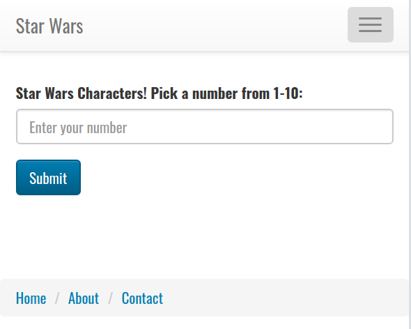

# Assessment #2

This project is designed to test your knowledge of the front end as well as the back end. You will be building an application that allows users to find information about Star Wars characters. 

The home page should look like this: 

When they click on Submit, they are taken to a page that should display the name, height, and hair color of that character. (Limit your search results to just the first 10 movie characters, ie. https://swapi.co/api/people/1 to https://swapi.co/api/people/10)

You will be using the The Starwars Database API.  https://swapi.co/
Read over the documentation and familiarize yourself with how to use it.  You may use one of the wrapper modules if you choose.

## TIME AVAILABLE

1. You will have from 9am to 1pm to complete the exam. Only the last commit before 1pm will be considered for grading.

1. Many students are able to complete the exam within the 4 hour class. With that said, do try taking breaks.

1. If you have not completed within the allotted time, keep working on it and complete it. Late submission will attract a 10% penalty.

## INTEGRITY:

Remember this review is a test of how well prepared you are. You need an honest answer. Try to satisfy the spirit of the review. While some of the questions may appear difficult, they CAN be answered with some amount of research and thinking. It is more important to learn from this experience, than to bypass it. As such, here are some ground rules

- No sharing of direct or indirect answers, between students.
- Absolutely no sharing of answer code.
- Absolutely no sharing of screens.
- No copying of wholesale code from the web. Make this your own work, even if referring to other projects.
- Any clarification from instructors should be posted on Slack under the channel **#assessments** such that all students have access to the same clarification.

## EVALUATION

1. The styles do not have to match exactly but should have some CSS or Bootstrap applied 

1. Nice to have feature, attracts 10% bonus:
- An error page for failed requests

