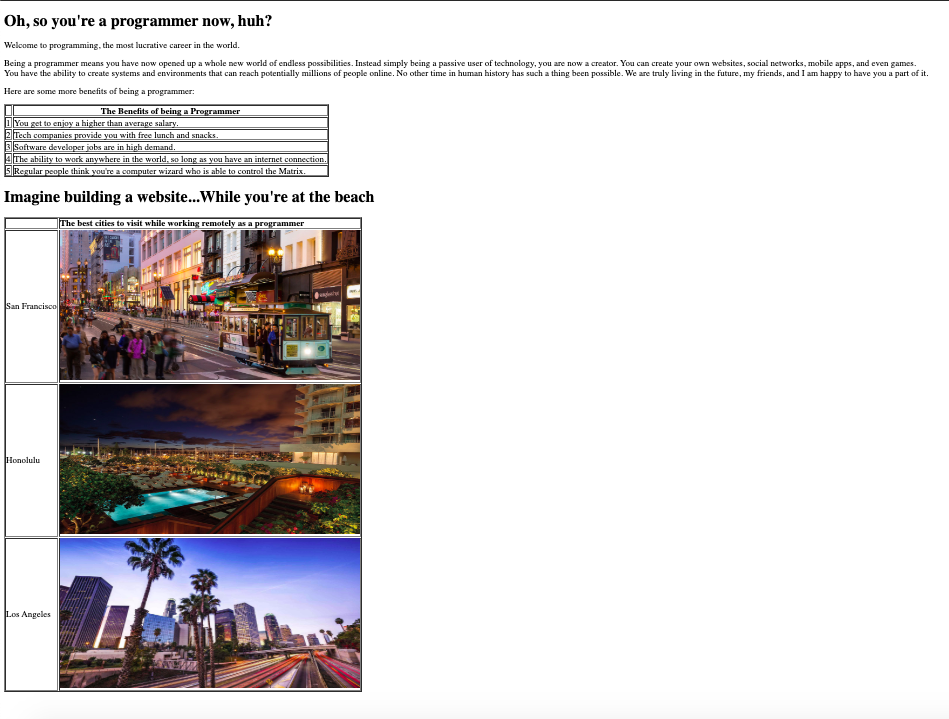

### AUSTIN COMMUNITY COLLEGE
### Web Software Bootcamp

# Command Line and HTML

# Objectives:

1) Learn the basics of using the command line interface (CLI)
1) Introduction to HTML elements and attributes
1) Work on projects to reinforce understanding of HTML
1) Validating HTML

# Learning Path

## <a id='_deadlines' href='#deadlines'>1. Deadlines</a>

1. 07/02/22 - Make sure to look over the recommended resources for HTML forms
1. 07/02/22 - Completed CoderVox Tutorial
1. 07/09/22 - Completed HTML projects
  
## <a id='_readings' href='#readings'>2. Readings</a>

1.  <a id='_subRead1' href='#subRead1' style='color: blue'>Command Line Interface</a>
1.  <a id='_subRead2' href='#subRead2' style='color: blue'>HTML</a>
  
## <a id='_codervox' href='#codervox'>3. CoderVox</a>

## <a id='_projects' href='#projects'>4. Projects</a>

1. <a id='_projects' href='#project1' style='color: blue'>Project 1: Command Line</a>
1. <a id='_projects' href='#project2' style='color: blue'>Project 2: Command Line - part 2</a>
1. <a id='_projects' href='#project3' style='color: blue'>Project 3: Command Line - part 3</a>
1. <a id='_projects' href='#project4' style='color: blue'>Project 4: HTML - Jon Arbuckle</a>
1. <a id='_projects' href='#project5' style='color: blue'>Project 5: HTML - Steve Jobs Fansite</a>
1. <a id='_projects' href='#project6' style='color: blue'>Project 6: HTML - Brunch Cafe</a>
1. <a id='_projects' href='#project7' style='color: blue'>Project 7: BONUS - HTML - Become a Programmer</a>

## <a id='_slides' href='#slides'>5. Slide Decks (if applicable)</a>
 
## <a id='_recommended' href='#recommended'>6. Recommended Resources</a>

1. <a id='_projects' href='#subResource1a' style='color: blue'>Basics of BASH for Beginners</a>
1. <a id='_projects' href='#subResource1' style='color: blue'>MDN HTML Introduction</a>
1. <a id='_projects' href='#subResource2' style='color: blue'>HTML Forms</a>
1. <a id='_projects' href='#subResource3' style='color: blue'>Mardown (.md files)</a>
1. <a id='_projects' href='#subResource4' style='color: blue'>HTML Validators</a>

  

# 
Readings

## 
Command Line Interface

#### <a id='subRead1' href="#_readings"> (back to top)</a>
 

Most of our learning of Command Line Interface (CLI) will be done in class and reinforced with projects 1 -3.

## 
HTML

#### <a id='subRead2' href="#_readings"> (back to top)</a>
 

Most of our HTML learning will be done in class and through the CodeVox tutorials with reinforcement through projects 4 -6.

Project #7 is a bonus project if you would like to keep practicing.

Lastly, one of the most overlooked aspects of HTML is validation. Most students skip this part of development.

When writing HTML, please run validation on it. You can use the W3C Markup Validation Service online [here](https://validator.w3.org/#validate_by_upload)
  
Another decent validator is a Chrome extension called HTML Validator.  Once enabled, it shows your mistakes in the Validator tab in Dev Tools. You may find the plugin [here](https://chrome.google.com/webstore/detail/html-validator/mpbelhhnfhfjnaehkcnnaknldmnocglk?hl=en-US).

# 
Slide Decks

#### <a id='slides' href='#_slides'>(back to top)</a>

These slides are for reference only and will not necessarily be used in class:

1. [Command Line](https://docs.google.com/presentation/d/1aHMf2KJHAmOfBUqCdfKoi4jcn_JtNyvdvcdlxwdqby8/edit?usp=sharing)

1. [HTML Intro](https://docs.google.com/presentation/d/1-9V2BBD74m7GjFewjOnlRWY8y0--hRKCWOVodbUOAM4/edit?usp=sharing)
  
1. [HTML Tables, Forms](https://docs.google.com/presentation/d/1tsi8GqRWjoADTmVJKFd7a4Rw1uN1XztSbYroA1stXz0/edit?usp=sharing)

1. [HTML Accessibility](https://docs.google.com/presentation/d/15YqgOBNO-6qFcoyCNba9B5yYtT5TgDSMpZT87W9tJik/edit?usp=sharing)

# 
CoderVox

#### <a id='codervox' href='#_codervox'>(back to top)</a>

## Tutorial
<h2 style='color: red'>TIME REQUIRED - 2 hours 42 mins</h3>

NOTE: Please keep in mind the `time required` refers to the videos at normal speed and just watching. If you are taking notes or coding along, double the required time in order to be prepared.

Please go through the following CoderVox videos before proceeding with projects 4 and after.

### [CoderVox - HTML](https://codervox.com/p/the-online-web-developers-bootcamp/?product_id=2625725&coupon_code=READYTOLEARNONLINE)

Sections 5.21 - 5.23

# 
Projects

## 
Project #1: Command Line

#### <a id='project1' href="#_projects"> (back to top)</a>
 

The goal of this project is to get you familiar with how to use the CLI.

1. Create a file called `commands.md`

    You can paste your queries into the file and submit to Github. You will not be submittiing anything else.

1. Perform the following using your CLI - NO GUI!!:
    1. On your desktop, create a folder named “soups”.
    1. Go inside of your soups folder. Create a file called “ChickenNoodle.html” and “BakedPotato.css”
    1. While you are inside of the soups folder, create another folder called “js”.
    1. Go inside of the js folder. 
    1. Where are we? Display the current path that we are on.
    1. Now go back 'up' to the soups folder.
    1. Create a file called “CreamyTomato.js” and put it in the js folder while still in the soups folder.
    1. Create a file called “readme.txt.” in the soups folder.
    1. On second thought, maybe we do not need a readme file right. Delete “readme.txt”.
    1. Go into the js folder.
    1. You decide you are not in the mood for creamy tomato. Rename “CreamyTomato.js” to “BroccoliCheddar.js”.
    
**You’re done!**

## 
Project #2: Command Line - part 2

#### <a id='project2' href="#_projects"> (back to top)</a>
 

This project will build on what you learned from Project 1.

<b>Note:</b> for this project, you cannot use the “cd” command at all once you are in the desktop path. Do everything from the desktop path of your command line.

1. Create a file called `commands2.md`

    You can paste your queries into the file and submit to Github. You will not be submittiing anything else.

1. Perform the following using your CLI - NO GUI!!:

    1. On your desktop, create a folder called “drinks”.
    1. Inside of drinks, create three folders: Smoothies, FrozenDrinks and IcedSpecialtyDrinks.
    1. Rename the “Smoothies” folder to “PowerSmoothies”.
    1. Inside of PowerSmoothies, create three files: 
        1. PeachAndBlueberry.txt, 
        2. GreenPassion.txt, and 
        3. Superfruit.txt.
    1. Inside of FrozenDrinks, create three files: 
        1. WatermelonStrawberryLemonade.html, 
        2. Caramel.html, and 
        3. Mocha.html.
    1. Inside of IcedSpecialityDrinks, create four files: 
        1. CaramelLatte.css, 
        2. ChaiTeaLatte.css, 
        3. CaffeMocha.css 
        4. CaffeLatte.css.
    1. Delete CaffeLatte.css. 

That’s enough caffeine for today!

## 
Project #3: Command Line - part 3

#### <a id='project3' href="#_projects"> (back to top)</a>
 

You may have to look at the `Command Line` slides for reference or do some online searches.

Answer as many as you can.

1. Create a file called `commands3.md`

    You can paste your answers into the file and submit to Github. You will not be submittiing anything else.

1. Please answer the following questions.

    1. What command would you use to clear the screen?

    1. What is the shortcut command to open a new tab in your terminal?

    1. What key would you use to scroll through previous commands you’ve typed before?

    1. You have a three txt files and an empty folder on your desktop. Write a single line command that will move all three txt files into the folder.

    1. You want to inspect the differences between two txt files myfile1.txt and myfile2.txt. Write a command that would display the differences in content between these two files.

    1. Write a command that would delete this folder and all of the contents inside.

    1. What is the command to list all files, including hidden files?  Write a command that displays all .css files in a folder.

    1. What is the command to find a file by name on your disk (or some other storage medium)?

    1. What is the command to find a file by content
        
        1. in your folder 
        2. on the disk?  
    
        That is, how do you search for a word or phrase in the file contents?

    1. Use a bash command to create a file named YourName.txt with no content in it.  Look at the permissions.
    
        1. Now change the permissions so everyone can read it and execute it.  
        2. Now change the permissions so only you can read it.

## 
Project #4: Jon Arbuckle

#### <a id='project4' href="#_projects"> (back to top)</a>
 

Your task is to re-create from scratch the website you see from the screenshots/videos. 

Each project is it’s own individual website which may have one or more pages.

<b>GOAL:</b> build a basic website with HTML

This is the home page of Jon Arbuckle, a cartoon character who owns a cat named Garfield.

1. Create a parent folder called `Project4`
1. Create a folder called `assets` inside the parent folder
    - Add the following image to your 'asset' folder: [Jon Arbuckle Image](./project_assets/Project1/jon-arbuckle.png)

1. Create a file called `index.html` inside your parent folder
1. When building this site, keep in mind that you:

    - Must use the br and hr tags (for now)
    - Must use the h1, u, strong, em, and p tags
    - Must create two lists: one ordered, and one unordered
1. Build the following website: 

## 
Project #5: Steve Jobs Fansite

#### <a id='project5' href="#_projects"> (back to top)</a>
 

Your task is to re-create from scratch the website you see from the screenshots/videos. 

Each project is it’s own individual website which may have one or more pages.

<b>GOAL:</b> How to link files and external websites

This project will help you gain experience in writing links in HTML by building a website devoted to the founder and former CEO of Apple Inc., Steve Jobs.

1. Create a parent folder called `Project5`
1. Create a folder called `assets` inside the parent folder
    - Add the following image to your 'asset' folder: [Steve Jobs Image](./project_assets/Project2/steve1.jpg)

1. The text on your page should be connected to the following links (if any of the links are broken, find your own link to substitute):

    - [Steve Wozniak](https://en.wikipedia.org/wiki/Steve_Wozniak)

    - [Apple II](https://en.wikipedia.org/wiki/Apple_II)

    - [Pixar](https://en.wikipedia.org/wiki/Pixar)

    - [Steve was a fantastic salesman](https://en.wikipedia.org/wiki/Reality_distortion_field)

    - [Remembering Steve](http://www.apple.com/stevejobs/)

    - [The Steve Jobs Biography](https://www.amazon.com/Steve-Jobs-Walter-Isaacson/dp/1451648537)

    - [The Steve Jobs Movie](http://www.imdb.com/title/tt2080374/)

1. There are three YouTube videos at the bottom the page. Here are the links:

- https://www.youtube.com/embed/upzKj-1HaKw
- https://www.youtube.com/embed/jcFbGsl8DDI
- https://www.youtube.com/embed/5fI3zz2cp3k

The completed site would look similar to below (images may be different based on YouTube links)...

## 
Project #6: Brunch Cafe

#### <a id='project6' href="#_projects"> (back to top)</a>
 

Complete the Brunch Cafe website on [CoderVox](https://codervox.com/courses/1174005/lectures/25213809)

Section 5.24 - only

## 
Project #7: BONUS - Become a Programmer

#### <a id='project7' href="#_projects"> (back to top)</a>
 

You are going to build a website that describes the benefits of being a programmer. This project will gain you experience in HTML tables.

Requirements:
    
  - use two tables
  - create a folder called `assets`
  - all your images need to be downloaded inside your assets folder. Use the following images:

    [San Francisco](./project_assets/Project5/sanfrancisco.jpg)

    [Honolulu](./project_assets/Project5/honolulu.jpg)
    
    [Los Angeles](./project_assets/Project5/LosAngeles.jpg)

The finished page should look similar to the following...

# 
Recommended Resources :

## 
Basics of BASH for Beginners

#### <a id='subResource1a' href="#_recommended"> (back to top)</a>
 

Learn about some of the most useful BASH commands and the utility they offer.

[Basics of BASH](https://towardsdatascience.com/basics-of-bash-for-beginners-92e53a4c117a)

## 
MDN HTML Introduction

#### <a id='subResource1' href="#_recommended"> (back to top)</a>
 

The following Mozilla Developer Network is an excellent, authoritative introduction to building web pages using HTML.  

It covers issues that you need to know as a developer and many HTML Introductory Courses skip over.
  
  [Mozilla Developer Network HTML Introduction](https://developer.mozilla.org/en-US/docs/Learn/HTML/Introduction_to_HTML/Getting_started)

## 
HTML Forms

#### <a id='subResource2' href="#_recommended"> (back to top)</a>
 

More resources on working with HTML forms:

### 1. HTML Forms
  [W3Schools](http://www.w3schools.com/html/html_forms.asp)

### 2. How to structure an HTML form
  [Mozilla Developer Network](https://developer.mozilla.org/en-US/docs/Web/Guide/HTML/Forms/How_to_structure_an_HTML_form)

## 
Markdown files

#### <a id='subResource3' href="#_recommended"> (back to top)</a>
 

Here is a great resource for working with `.md` files:

[Mastering Markdown](https://guides.github.com/features/mastering-markdown/)

## 
HTML Validators

#### <a  id='subResource4' href="#_recommended"> (back to top)</a>
 

A cuple options for ensuring your HTML is not missing anything:

[W3C Markup Validation Service](https://validator.w3.org/#validate_by_upload)

[Chrome HTML Validator](https://chrome.google.com/webstore/detail/html-validator/mpbelhhnfhfjnaehkcnnaknldmnocglk?hl=en-US).

