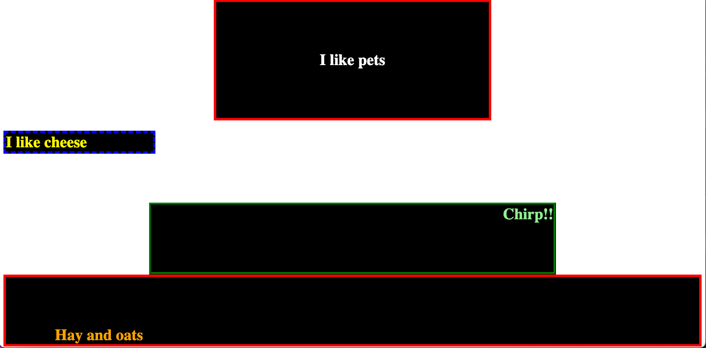
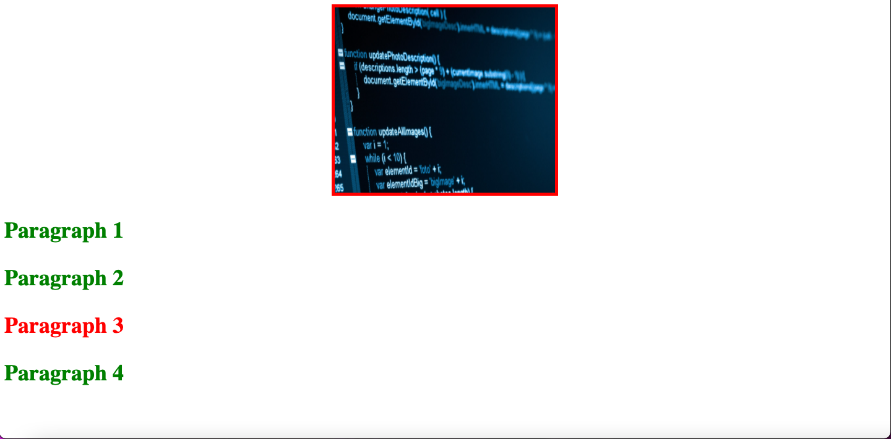
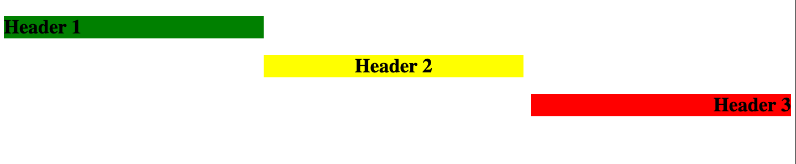
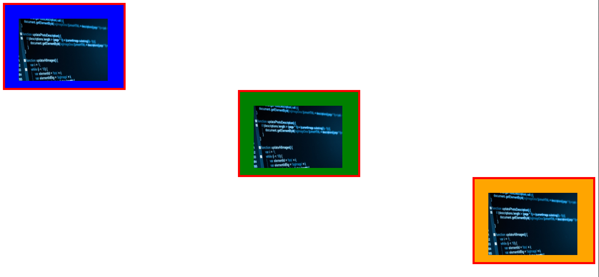
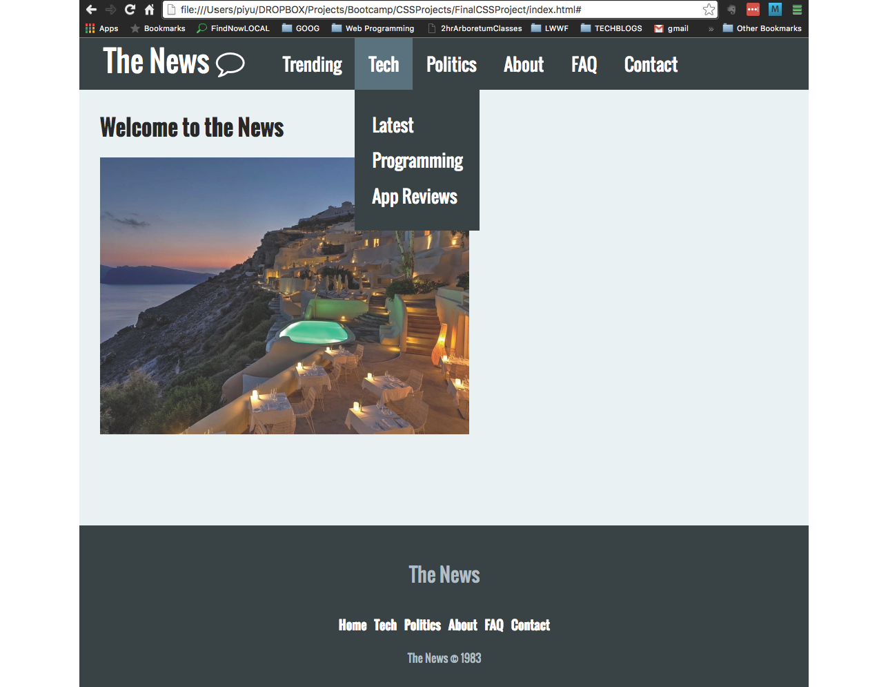
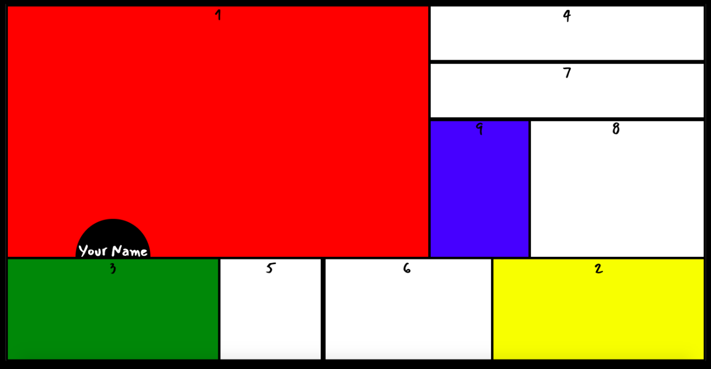

### AUSTIN COMMUNITY COLLEGE
### Web Software Bootcamp

# CSS

# Objectives:

1) Brief overview of basic CSS
1) When and why to use

    1)   inline CSS
    1)   internal CSS
    1)   external CSS
1) What is a box model
1) Difference between inline and block elements
1) What is meant by specificity and inheritance 

# Learning Path

## <a id='_deadlines' href='#deadlines'>1. Deadlines</a>

1. 07/05/22 - Finished with the readings
1. 07/07/22 - Completed the Codervox tutorial
1. 07/09/22 - Make sure you have pushed ALL your completed projects at this point to Github by midnight
1. 07/16/22 - Should be done with ALL CSS projects and goals.
1. 07/16/22 - Push projects to GitHub by midnight
  
## <a id='_readings' href='#readings'>2. Readings</a>

1.  <a id='_subRead1' href='#subRead1' style='color: blue'>CSS - Intro</a>
1.  <a id='_subRead2' href='#subRead2' style='color: blue'>CSS - Text/Font</a>
1.  <a id='_subRead3' href='#subRead3' style='color: blue'>CSS - Positioning</a>
1.  <a id='_subRead4' href='#subRead4' style='color: blue'>CSS - Specificity and Inheritance</a>
  
## <a id='_codervox' href='#codervox'>3. CoderVox</a>

## <a id='_projects' href='#projects'>4. Projects</a>

1. <a id='_projects' href='#project1' style='color: blue'>Project 1: CSS Mini Exercises</a>
1. <a id='_projects' href='#project2' style='color: blue'>Project 2: The News</a>
1. <a id='_projects' href='#project3' style='color: blue'>Project 3: BONUS - Positioning</a>

## <a id='_slides' href='#slides'>5. Slide Decks (if applicable)</a>

## <a id='_recommended' href='#recommended'>6. Recommended Resources</a>

1. <a id='_projects' href='#subResource1' style='color: blue'>W3Schools - CSS</a>
1. <a id='_projects' href='#subResource2' style='color: blue'>MDN</a>
1. <a id='_projects' href='#subResource3' style='color: blue'>Fonts</a>
1. <a id='_projects' href='#subResource4' style='color: blue'>Font Awesome</a>
  

# 
Readings

## 
CSS - Intro

#### <a id='subRead1' href="#_readings"> (back to top)</a>
 

Go through W3Schools online tutorial.

Read through sections `CSS Home` through `CSS Outline`

Feel free to code along as you see fit. Otherwise, reading and note-taking is fine.

[W3Schools - CSS](https://www.w3schools.com/css/default.asp)

## 
CSS - Text/Font

#### <a id='subRead2' href="#_readings"> (back to top)</a>
 

Go through W3Schools online tutorial.

Read through sections `CSS Text` through `CSS Icons`

Feel free to code along as you see fit. Otherwise, reading and note-taking is fine.

[W3Schools - Text](https://www.w3schools.com/css/css_text.asp)

Also, go to [Font Awesome](https://fontawesome.com) and create an account. You will need this account going forward.

## 
CSS - Positioning

#### <a id='subRead3' href="#_readings"> (back to top)</a>
 

Go through W3Schools online tutorial.

Read through sections `CSS Display` through `CSS Align`

Feel free to code along as you see fit. Otherwise, reading and note-taking is fine.

[W3Schools - Display](https://www.w3schools.com/css/css_display_visibility.asp)

## 
CSS - Specificity

#### <a id='subRead4' href="#_readings"> (back to top)</a>
 

Go through W3Schools online tutorial.

Read section `CSS Specificity`

Feel free to code along as you see fit. Otherwise, reading and note-taking is fine.

[W3Schools - Specificity](https://www.w3schools.com/css/css_specificity.asp)

Then look through MDN:

[MDN - Inheritance](https://developer.mozilla.org/en-US/docs/Learn/CSS/Building_blocks/Cascade_and_inheritance)

# 
Slide Decks

#### <a id='slides' href='#_slides'>(back to top)</a>

These slides are for reference only and will not necessarily be used in class:

1. [CSS - Introduction](https://docs.google.com/presentation/d/1FE5rck0M7hWJ87kxM-bCDjDMJ2GleycWidClVstgDGg/edit?usp=sharing)

2. [CSS - Pseudoclasses](https://docs.google.com/presentation/d/19sgRj47yQHWvscuoy0keftnSHTThZRP7IpIa_OCwk_8/edit?usp=sharing)

# 
CoderVox

#### <a id='codervox' href='#_codervox'>(back to top)</a>

## Tutorial
<h2 style='color: red'>TIME REQUIRED - 3 hours 20mins</h3>

Please go through the following CoderVox videos before proceeding.

### [CoderVox - CSS](https://codervox.com/p/the-online-web-developers-bootcamp/?product_id=2625725&coupon_code=READYTOLEARNONLINE)

Section 6 - only

# 
Projects

## 
Project #1: Mini Exercises

#### <a id='project1' href="#_projects"> (back to top)</a>
 

All tasks will be done with one HTML and one CSS file.

Answer the questions as comments inside your CSS file.

Create a parent folder called `Project1`.

Inside the parent folder you will have an `assets` folder, an `index.html` file, and a `style.css` file.

Task #1 - Selectors

1. Create an `h1` tag with a class of `cat` and an id of `dog`.
1. Add some content.
1. Using the tag, add a solid red border of 5px
1. Using the class, change the background color to black
1. Using the id, change the content color to white
1. How does this look in your browser?

Task #2 - Selectors

1. Create another `h1` tag, this time with a class of `cat` and an id of `mouse`.
1. Add some content.
1. Look at your browser. What do you notice? Why?
1. Using the id, change the content color to yellow.
1. Change the border color to blue, dashed and 5px.

Task #3 - Selectors

1. Create another `h1` tag, this time with a class of `cat` and an id of `bird`.
1. Add some content.
1. Look at your browser. What do you notice? Why?
1. Using the id, change the content color to lightgreen.
1. Change the border so it has a color of green ridged and 5px;

Task #4 - Width

1. Add a width of 25% to your first h1.
1. Add a width of 200px to your second h1.
1. Add a width of 50 viewer width (vw) to third h1.
1. Resize your browser.
1. What do you notice? What are the differences between %, px, and vw? Why are they important?

Task #5 - Text

1. Using your first h1, align your text so it is centered.
1. Using your third h1, align the text so it is on the right.

Task #6 - Margin

1. Using margin, center the first h1 in the middle of your screen.
1. Using margin, center the third h1 in the middle of your screen and add a top margin of 100 pixels and bottom of 0 pixels.
1. Create a fourth `h1` tag, this time with a class of `cat` and an id of `horse`.
1. Add some content with an orange color.
1. Using margin, center the fourth h1 in the middle of the screen.
1. What happened? Why? How do you fix so you can center it?

Task #7 - Padding

1. Add 100px padding to all sides of content in your first h1 (do not use shorthand).
1. Add 100px of padding to the right-side ONLY in your second h1 (do not use shorthand).
1. Add 100px of padding to the right-side and bottom ONLY in your third h1 (do not use shorthand).
1. Using the padding shorthand, add 100px padding to top and left in your fourth h1.

At this point, you should see something like this in your browser:

  

Comment out your h1 tags.

Task #8 - Images and Inline Elements

1. Add the following image to your assets folder: [code image](./project_assets/project_1/computer-code.jpeg)
1. Add an image tag to your `index.html` linked to the image you added to your assets folder.
1. What happened???
1. Add a width of 50%.
1. Using margin, center the image in the middle of screen.
1. What happened? Why? (HINT: research inline versus block elements)
1. Add a div tag and move your image tag into the div
1. Add a border to the div. 
1. What do you notice?
1. Add a width of 25% to your div.
1. What is happening ot the image inside?
1. Comment out the width of your image.
1. Notice the border in comparison to your image?
1. Uncomment your width of the image and change to 100%.
1. Look better?
1. Notice the small white space under the image. Why is this happening?

Task #9 - Images, Margin and Padding

1. Add a height of 300px to your div.
1. Add a height of 100% to your image.
1. Using margin, center the div in the middle of the screen.

Task #11 - Specificity and Inhertitance

1. Add four `p` tags with various, short content.
1. Using the `p` tag selector, increase the font size of ALL the content to 36px.
1. Using the `p` tag, change the weight of the font to `bold` for all the element.
1. Add ids to each of the elements: `p1`, `p2`, `p3`, and `p4`
1. Add `changeFont` as a class to each of the elements.
1. Using tag and class combination, change the color of all the content to darkblue
1. Using the id, change the color of the third `p` tag content to red.
1. Why did the other elements NOT change color?
1. Add the following after all the other `p` tag styling:  `p { color: green}`
1. Anything happen? Why or why not?
1. Change the styling in #9 to `p.changeFont { color: green}`.
1. What happened to the third element? Why did it not change?

At this point, you should see something like this in your browser:

Task #12 - Speed Round

1. Add three h2 tags with various content

    * make the font bold and 36px in size
    * give them various background colors
    * style them so they are staggered like steps
    

1. Add three images to your html using divs

    * add borders to the images
    * postion the images inside divs so they have a clored background
    * style them so they are staggered like steps
    

## 
Project #2: The News

#### <a id='project2' href="#_projects"> (back to top)</a>
 

In this project, you’ll build the front page of a website complete with a navigation bar, body and footer.

You will need to take everything you have learned from the readings, mini-exercises and tutorials to build. Please do not attempt this UNTIL you have completed the CoderVox tutorials.

### Preview

The completed page looks similar to this:

  

### REQUIREMENTS

The body of the page should:

* Have the font ‘Oswald’ from Google Fonts and have the background color of `#eaf0f2`

The navbar should:

* Have a font size of 25px
* Have a background color of #263238
* Height of 75px
* Should change colors when you hover over a menu item (#546E7A)
* There will be five menu items: Trending, Tech, Politics, About, FAQ, Contact
* Under ‘Trending’, it should have a dropdown menu with Entertainment, Travel, and Education
* Under ‘Tech’, it should have a dropdown menu with Latest, Programming, and App Reviews
* Under ‘Politics’, it should have a dropdown menu with Headlines, The Facts, and The Gossip
* Under ‘About’, it should have a dropdown menu with Our Story and Donate
* Under ‘FAQ’, it should have a dropdown menu with Our Policy and Careers
* Under Contact, it should have a dropdown menu with Email and Phone

The logo should:

* Be 42px and have top and bottom padding of 15px, and left and right padding of 35px, and a line height of 35px.
* Check out Font Awesome for the `comment` icon

The dropdown menu items in the navigation bar should:

* Have a height of 45px
* Have a line height of 45px
* Top and bottom padding of 15px and left and right padding of 20px
* Become a light color when you hover over a link (`CFD8DC`) 
* Have a transition time of 0.6 seconds.

The footer should:

* Have a background color of `263238`
* Have a font size of 18px
* Padding of 50px on all sides
* Margin top of 75px
* “The News” should have a color of `B0BEC5` and a font size of 28px
* The copyright should have a color of `B0BEC5` and a font size of 16px
* When you hover over the links, the color should change to `CFD8DC`

Hints:

* You will need to set the max height to 0px to make the submenu collapsed by default. You will will also need to use the position and overflow CSS properties.
* You will use the transition property to make the animation effect of the dropdown menu.
* use this image for now : [Clifftop](./project_assets/project_2/clifftop.jpg)

## 
Project #3: BONUS - Positioning

#### <a id='project3' href="#_projects"> (back to top)</a>
 

Who is [Piet Mondrian](https://www.artsy.net/artist/piet-mondrian)?

Your challenge is to recreate the Mondrian-inspired image below using given starter code for HTML, and do ALL styling with CSS. 

Try to duplicate as close as you can. Your results will not be perfect but should be close.

This is to give you a better understanding of positioning.

Ready?

Inside the body, please use this HTML. Do not add to it nor alter in any way:

      <body>
        
1

        
2

        
3

        
4

        
5

        
6

        
7

        
8

        
9

        

Your Name

      </body>

Use google fonts - `Mansalva`.

You should be able to do this with postioning, borders, and background colors.

Create this:

  

# 
Recommended Resources :

## 
W3Schools - CSS

#### <a id='subResource1' href="#_recommended"> (back to top)</a>
 

A great to place to star for basics of most programming topics.

[W3Schools - CSS](https://www.w3schools.com/css/default.asp)

## 
MDN - CSS

#### <a id='subResource3' href="#_recommended"> (back to top)</a>
 

If you would like a more in-depth dive into CSS

[Mozilla Developer Network](https://developer.mozilla.org/en-US/docs/Web/CSS)

## 
Fonts

#### <a  id='subResource4' href="#_recommended"> (back to top)</a>
 

Your font usage is only limited by your imagination.

Take a look at the following for inspiration:

[Google Fonts](https://fonts.google.com/)

[Font Space](https://www.fontspace.com/)

[1001 Fonts](https://www.1001fonts.com/)

And there are many others. Google what you are looking for.

Holiday, scary, kid friendly, etc...

You will be surprised by the options that exist for you for free. 

There are also fonts you can pay for, but most of the above should be free.

## 
Font Awesome

#### <a id='subResource5' href="#_recommended"> (back to top)</a>
 

[Font Awesome](https://fontawesome.com)

