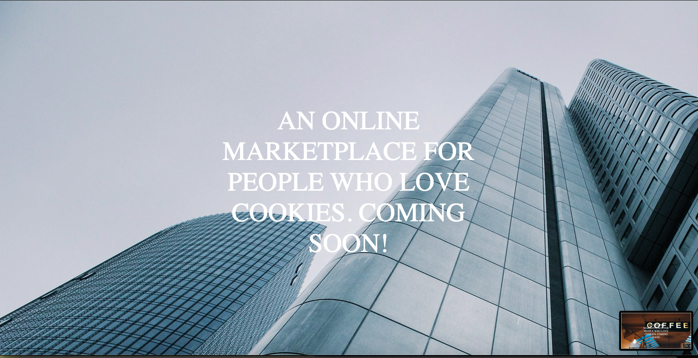
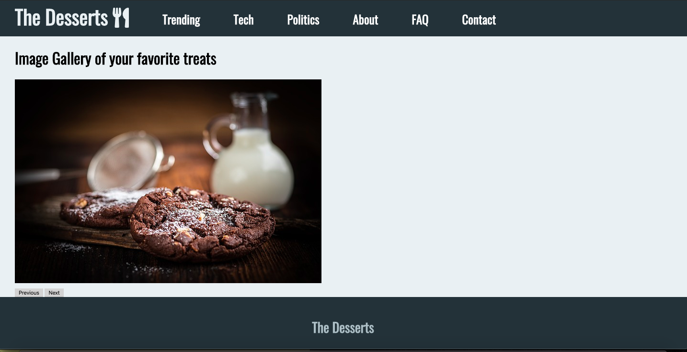

<center>

### AUSTIN COMMUNITY COLLEGE
### Web Software Bootcamp

# JavaScript

</center>

# Objectives:

1) Understand JavaScript fundamentals

    1) data types
    1) variables
    1) control flow
    1) functions
    1) arrays and strings
    1) objects 

1) Understand what is DOM and how to manipulate through explicit selection and event handlers/listeners

1) Understand basic ES6 topics

1) Demonstrate knowledge through projects and Code Wars practice

<hr><hr>
<center>

# Learning Path

</center>

## <a id='_deadlines' href='#deadlines'>1. Deadlines</a> 

Tentative Schedule. 

Please keep in mind, we will be focusing on JavaScript in various ways for the next few weeks. In between lectures, we may add more review, labs, and other ways to reinforce JavaScript concepts.

1. 07/21/22 - May still be working on Bootstrap, but please go through Readings #1 in case we introduce JavaScript early.
1. 07/23/22 - Readings #2 before class
1. 07/23/22 - Push projects before midnight
1. 07/26/22 - Readings #3 before class
1. 07/28/22 - Readings #4 before class
1. 07/30/22 - Readings #5 before class
1. 07/30/22 - Push projects before midnight
1. 08/02/22 - Readings #6 and # 7 before class 
1. 08/02/22 - Push projects before midnight - will not receive reminders going forward.
1. 08/11/22 - Should be done with ALL HTML, CSS, and Javascript projects. We will be moving in a new direction with a new focus after this date
  
## <a id='_readings' href='#readings'>2. Readings</a>

1.  <a id='_subRead1' href='#subRead1' style='color: blue'>JavaScript - Basics</a>
1.  <a id='_subRead2' href='#subRead2' style='color: blue'>JavaScript - Control Flow</a>
1.  <a id='_subRead3' href='#subRead3' style='color: blue'>JavaScript - Functions</a>
1.  <a id='_subRead4' href='#subRead4' style='color: blue'>JavaScript - Arrays</a>
1.  <a id='_subRead5' href='#subRead5' style='color: blue'>JavaScript - Objects</a>
1.  <a id='_subRead6' href='#subRead6' style='color: blue'>JavaScript- DOM</a>
1.  <a id='_subRead7' href='#subRead7' style='color: blue'>ES6 and Beyond</a>
1.  <a id='_subRead8' href='#subRead8' style='color: blue'>Code Wars</a>


  

## <a id='_codervox' href='#codervox'>3. CoderVox</a>


## <a id='_projects' href='#projects'>4. Projects</a>

1. <a id='_projects' href='#chalkboard' style='color: blue'>Chalkboard Projects - DO FIRST!!</a>
1. <a id='_projects' href='#project1' style='color: blue'>Project #1 - Greetings</a>
1. <a id='_projects' href='#project2' style='color: blue'>Project #2 - The Function</a>
1. <a id='_projects' href='#project3' style='color: blue'>Project #3 - The Array</a>
1. <a id='_projects' href='#project4' style='color: blue'>Project #4 - Rotating Background</a>
1. <a id='_projects' href='#project5' style='color: blue'>Project #5 - Image Gallery</a>
1. <a id='_projects' href='#project6' style='color: blue'>Project #6 - The Clock</a>
1. <a id='_projects' href='#project7' style='color: blue'>BONUS Projects</a>

## <a id='_slides' href='#slides'>5. Slide Decks (if applicable)</a>
 
## <a id='_recommended' href='#recommended'>6. Recommended Resources</a>

1. <a id='_projects' href='#subResource1' style='color: blue'>JavaScript Tutorial Alternatives</a>
1. <a id='_projects' href='#subResource2' style='color: blue'>Code Wars</a>

  
<hr><hr>

# <center>Readings

## <center>JavaScript Basics</center>
#### <a id='subRead1' href="#_readings"> (back to top)</a>
<br>

For the next few weeks, we will begin learning about one of the
central topics of the bootcamp: JavaScript.

According to [Northeastern University](https://www.northeastern.edu/graduate/blog/most-popular-programming-languages/) - JavaScript is number 2 behind Python.

Why Python? Python is used in many ways, but particularly with the rise of data analysis, Python has been the go to.

But with the world beoming more internet and web oriented, JavaScript is more important than ever. 

Even with Python, which can be used on the the backend of a web app, you would still need JavaScript for the frontend.

JavaScript is starting to become more common place in the fields of AI, data analysis, and VR.

JavaScript is very popular, versatile, and once you get the foundations down, can be used to better understand other languages.

In order to get started, we need to begin with the basics.

Please go to the <a href='#codervox'>CoderVox Tutorial</a> and focus on section 8 - TIME REQUIRED -> 2 hours 10 min


<hr>

## <center>Control Flow</center>
#### <a id='subRead2' href="#_readings"> (back to top)</a>
<br>

With JavaScript, you will need to control the flow of how and what code is run. We can do this with conditionals (covered in previous reading) or with iterations.

You will probably hear the term `loop` a lot which is one type of iteration.

Keep in mind, when we are discussing iterations, we are talking about a method which allows us to `go through` something. These can be `for` or `while` loops as well as other methods such as `.forEach()` and `.map()`. 

These are all iterators. The most common to start with are `for` loops.

Please go to the <a href='#codervox'>CoderVox Tutorial</a> and focus on section 9 - TIME REQUIRED -> 35 min

<hr>

## <center>JavaScript - Functions</center>
#### <a id='subRead3' href="#_readings"> (back to top)</a>
<br>

So far, we have written basic code that seems random and unrelated. But what if we only want our code to run at a certain time, or be used in other parts of our code?

What about 'packaing' related code together?

This is the power of functions.

Please go to the <a href='#codervox'>CoderVox Tutorial</a> and focus on section 10 - TIME REQUIRED -> 1 hour 20 min

<hr>

## <center>JavaScript - Arrays</center>
#### <a id='subRead4' href="#_readings"> (back to top)</a>
<br>

Now that we know how to use functions, we can spend more time on better understanding two specific 'data types' and their methods: `arrays` and `objects`.

As you will learn, `strings` are a form of array and many methods we can use on `arrays` can also be used on `strings`.

Please go to the <a href='#codervox'>CoderVox Tutorial</a> and focus on section 11 - TIME REQUIRED -> 1 hour

<hr>

## <center>JavaScript Objects</center>
#### <a id='subRead5' href="#_readings"> (back to top)</a>
<br>

Now that you are an expert on how to create arrays, reference values in an array, it is time to push on to `objects`. 

You may notice some similarities in the methods used, BUT these are not the same as arrays.

Please go to the <a href='#codervox'>CoderVox Tutorial</a> and focus on section 12 - TIME REQUIRED -> 30 min

<hr>

## <center>JavaScript - DOM</center>
#### <a id='subRead6' href="#_readings"> (back to top)</a>
<br>

One of the most important concepts of web design is understanding the hierachy of the elements in our html. This hierarchy is referred to as DOM - Document Object Model.

Our browser is just one giant object and we have access to EVERYTHING inside it. Not just the elements tha we see in the dev tools, but the methods and relationships, and events, and many cool things you probably never knew existed.

Also, you must remember, once you build your HTML and it is deployed, that is it!!! You can not change it. 

But what if you wanted to add an image later, or show some cool animation when a user clicks on a button?

We can do this all with JavaScript and this allows us to alter the HTML even after it has been built and deployed.

Please go to the <a href='#codervox'>CoderVox Tutorial</a> and focus on sections 13 and 14 - TIME REQUIRED -> 2 hours 15 mins

<hr>

## <center>ES6 and Beyond</center>
#### <a id='subRead7' href="#_readings"> (back to top)</a>
<br>

Now that you have the foundations of JavaScript down, there are some new updates over the years which make like easier for us coders. 

This involves what is known as ES6, ES7, and other fun features. Some of these you have already seen, many will be new.

For a quick overview, please scan over this article: [Features I Wish I’d Known About ES6 & ES7](https://dev.to/pixelplex/features-i-wish-i-d-known-about-es6-es7-42ff)

We will be covering much of this over the rest of Bootcamp. 

Please feel free to start using these shortcuts now and going forward.

<hr>

## <center>Code Wars</center>
#### <a id='subRead8' href="#_readings"> (back to top)</a>
<br>

Take a look at the the <a id='_projects' href='#subResource2' style='color: blue'>Code Wars</a> under Recommended Resources. Be aware,  this great way to practice JavaScript and fill in your knowledge with this website.
You should be coding something EVERY DAY!!


<hr><hr>

# <center>Slide Decks

#### <a id='slides' href='#_slides'>(back to top)</a>

These slides are for reference only and will not necessarily be used in class:

1. [Lecture 1 - JavaScript - an Introduction](https://docs.google.com/presentation/d/1nNa7eba8MViSsl1h6jT0fAmcjMxqSu_Fs8RSjTedFLY/edit?usp=sharing)
2. [Lecture 2 - JavaScript - Control Flow](https://docs.google.com/presentation/d/1UXZHJi2T5joQOnJbWmTv31Bn5Fuku6cK5jDnNgN0iSs/edit?usp=sharing)
3. [Lecture 3 - JavaScript - Functions](https://docs.google.com/presentation/d/1Lem0KfwlCvjFW-Zd9byDKkI8dzXiKM06FfCAARncreQ/edit?usp=sharing)
4. [Lecture 4 - JavaScript - Arrays](https://docs.google.com/presentation/d/1eqJZoEXijv0lonxDTz8GK6wZw13_CQtpLHrx8Vj_U9I/edit?usp=sharing)
5. [Lecture 5 - JavaScript - Arrays, Objects, Strings](https://docs.google.com/presentation/d/1JGwOJadygv2yGks_WBDBTy49m6M9Xibbvay0c3Lsd3g/edit?usp=sharing)
6. [Lecture 6 - JavaScript - DOM](https://docs.google.com/presentation/d/10wz48XqfftftF_cOPv-yqp1avRzTV5HjL_OACTlIkOY/edit?usp=sharing)
7. [Lecture 7 - JavaScript - ES6 and After](https://docs.google.com/presentation/d/1xLBKQhwwsefC5bO1ffOunQdMyQx0Z6rjLyi_n0gQw8I/edit?usp=sharing)

<hr><hr>

# <center>CoderVox</center>

#### <a id='codervox' href='#_codervox'>(back to top)</a>

## Tutorial
<h2 style='color: red'>TIME REQUIRED - please check readings for specific times</h3>

Please go through the following CoderVox videos:

<center>

### [CoderVox - JavaScript](https://codervox.com/p/the-online-web-developers-bootcamp/?product_id=2625725&coupon_code=READYTOLEARNONLINE)

Focus on **Sections 8 thru 14** - JavaScript

</center>

<hr><hr>

# <center id='projects'>Projects</center>

## <center>Chalkboard Projects</center>
#### <a id='chalkboard' href="#_projects"> (back to top)</a>
<br>

In order to better  understand functions, you will need to practice. You are going to use the "chalkboard" approach, where you write something over and over again to gain muscle memory.

Ever had to write the same sentence over and over and over on the chalkboard? That is what you are going to do.

1. Create a file called `script.js`. Create a file called `index.html` with boilerplate HTML in it. Load the `script.js` file in the HTML file so you may run script.js commands in a browser.
	1. You may use the console in your dev tools to practice
	1. DO NOT copy and paste - purpose is to build the muscle memory NOW
1. Write a NAMED function called `animal` that console logs the name of an animal. Now execute that function. You will need to do this FIVE times - the same function - only you will console a DIFFERENT animal each time, by executing the function five times.

1. Write a NAMED function called `cities` that console logs the name of your favorite cities you would like to visit. You will need to do this FIVE times - the same function - only you will console a DIFFERENT city each time.

1. Write a NAMED function called `favBook` that takes ONE argument. 
	1. The argument will accept a string value of your favorite book and console log it.
	1. You will need to do this FIVE times - the same function - only you will change the name of the variable that will accept the string.
	1. Test by invoking at least once.
1. Write a NAMED function called `money` that will accept two arguments - one for a number, and one for a string.
	1. You will need to do this ONE time.
	1. Should console log something like: "Hey \<string> can I borrow $\<number> from you?"
	1. Invoke this function FIVE times passing in different numbers and strings


When you are done, you should have 16 functions written.

Please push to Github BEFORE working on ANY of the projects.

BONUS: re-write ALL the functions as fat arrow functions
<hr>


## <center>Project #1 - Greetings</center>
#### <a id='project1' href="#_projects"> (back to top)</a>
<br>

This project will not be a “real” website per se, but rather is meant to give you practice on how to think logically using JavaScript.

Create an index.html and a script.js file. When the index.html page is opened, the user should be prompted with three pop boxes that ask the following questions:

* Please enter your name.
* What is your favorite snack?
* What is your favorite drink?

After the user inputs the data, a message should display on the page “Hi there _______, it seems that you enjoy eating _______ and drinking ________!”

The blanks should be filled with text that the user wrote.

Note: make the body of page have a font size of 96px to make it easier to see.

<hr>

## <center>Project #2 - The Function</center>
#### <a id='project2' href="#_projects"> (back to top)</a>
<br>

This project will not be a “real” website per se, but rather is meant to give you practice on how to think logically using JavaScript.

Create an index.html and a script.js file. When the index.html page is opened, the user should be prompted with three pop boxes that ask the following questions:

* Tell me your name.
* Give me a number.
* Give me another number.

You will then need to create <u>```TWO```</u> functions in your script.js file. 

The first function takes the name and returns a sentence that says “You are going to have a wonderful day, _____.”

The second function should return another sentence that says “By the way, the sum of your numbers is _____.” The blank should be the sum total of the two numbers that were entered by the user.

`Note`: make the body of page have a font size of 96px to make it easier to see.

You should be familiar with the differences between strings and integers, and how to convert them from one to the other.

<hr>

## <center>Project #3 - The Array</center>
#### <a id='project3' href="#_projects"> (back to top)</a>
<br>

This project will not be a “real” website per se, but rather is meant to give you practice on how to think logically using JavaScript.

Create a `index.html` and `script.js` file. When the index.html page is opened, the user should be prompted with three pop boxes that ask the following questions:

* Give a number.
* Give a another number.
* Give a number again.

Then create a for loop that adds all the numbers together, and writes to the page “The sum of all of your numbers is
_____.”

<hr>

## <center>Project #4- Rotating Background</center>
#### <a id='project4' href="#_projects"> (back to top)</a>
<br>

For this project we are going to build a single page website that has a rotating background image with some text splashed across it..

* The background image should rotate every 3 seconds. 
* The text should be 54px.
* The text should have a width of 900px.

In order to make the images rotate, you'll need to be familiar with JavaScript and how to:
* Work with functions
* Work with arrays, as well iterating through them
* work with JavaScript DOM elements
* Use conditional statements

* SCREENSHOT: (your code will rotate through these images in order)




#### ASSETS NEEDED
- [Image 1](./project_assets/Project4/img/background1.jpg)
- [Image 2](./project_assets/Project4/img/background2.jpg)
- [Image 3](./project_assets/Project4/img/background3.jpg)

<hr>

## <center>Project #5- Image Gallery</center>
#### <a id='project5' href="#_projects"> (back to top)</a>
<br>

In this project, you will build a simple image gallery. When we press on the buttons, they will rotates through a set number of images that will coninually rotate forward or backward depending on which button is clicked - `next` or `previous`. 

This is often called a carousel.

The body of the page should:
* Use the same layout from CSS Project 4 (maybe in previous week), minus the previous image of the clifftop house.
* Use the `onClick` attribute in HTML
* Images should ONLY change when buttons are clicked
* There are two buttons - `PREV` and `NEXT`
	* When the user clicks prev, they are taken back to the previous image
	* when the user clicks next, they are taken forward to the next image
	* You are creating an 'endless' loop of images no matter which button the user clicks


With Javascript, you should:
* Use functions and know how to pass arguments into them
* Work with JavaScript DOM elements
* Use conditional statements
* Use an array to hold your images
* SCREENSHOT (one page)



#### ASSETS NEEDED
[Image 1](./project_assets/Project5/img/1.jpg)

[Image 2](./project_assets/Project5/img/2.jpg)

[Image 3](./project_assets/Project5/img/3.jpg)

[Image 4](./project_assets/Project5/img/4.jpg)

[Image 5](./project_assets/Project5/img/5.jpg)

[Image 6](./project_assets/Project5/img/6.jpg)

<hr>

## <center>Project #6- The Clock</center>
#### <a id='project6' href="#_projects"> (back to top)</a>
<br>

In this project, we'll build a beautiful clock that displays the time and changes background color every second.

The body of the page should:
*  Rotate through the following colors: '#4FC3F7', '#29B6F6', '#03A9F4', '#039BE5', '#0288D1', '#0277BD', '#01579B',
				  '#9575CD', '#7E57C2', '#673AB7', '#5E35B1', '#512DA8', '#4527A0', '#311B92',
				  '#7986CB', '#5C6BC0', '#3F51B5', '#3949AB', '#303F9F', '#283593', '#1A237E',
				  '#64B5F6', '#42A5F5', '#2196F3', '#1E88E5', '#1976D2', '#1565C0', '#0D47A1'

With JavaScript, you will:
*  need to use functions (and perhaps even have a function within a function)
*  need to use a new Date object to get the time
*  need to know how to get the seconds, minutes, and hour
*  need to know how to correct format the time
*  need to use conditional statements
*  need to know how to set interval to get the time every second
*  SCREENSHOT (colors will change every second)


<hr>

## <center>BONUS Projects</center>
#### <a id='project7' href="#_projects"> (back to top)</a>
<br>

If you have completed all the above projects and want more practice, please reach out to an instructor and we can link you to more projects as well as various exercises for more practice.

<hr><hr>

# <center id='recommended'>Recommended Resources :</center>

## <center>JavaScript Tutorial Alternatives</center>
#### <a id='subResource1' href="#_recommended"> (back to top)</a>
<br>

At this time in the Bootcamp, it is strongly recommended to follow along with the readings and CoderVox.

However, some people have found the follwoing two alternatives very helpful. 

The Bootcamp will be based on CoderVox but please feel free to use the follwoing and related materials in place of CoderVox:

[New Ninja - YouTube](https://www.youtube.com/playlist?list=PL4cUxeGkcC9i9Ae2D9Ee1RvylH38dKuET)

OR

[You Don't Know JS](https://github.com/getify/You-Dont-Know-JS/tree/2nd-ed/get-started)

You will NOT have time for all three during the Bootcamp so please pick one: CoderVox, YouTube, or 'book' for now and go back and look at the others for reference as needed.

<hr>

## <center>Code Wars</center>
#### <a id='subResource2' href="#_recommended"> (back to top)</a>
<br>

Code Wars is a great way to practice your JavaScript (or any language) in a fun, level-building way.

It will be extremely beneficial to take some time and try out the following algorithms on Code Wars. 

Highly recommended to do these following coding challenges and then sign up on Code Wars and do more coding challenges every day (at least once a week).

Not only is it fun, but you learn how to write code in many different ways.

The intent is not for you to necessarily do all these before the projects, BUT it is a way to get practice on the fundamentals. 
Maybe do these in between each of the projects. 

Also, the format is very similar to how some companies will send you interview  whiteboarding. Good to see this now rather than later.

## LINK to sign up-> [CodeWars](www.codewars.com/r/dWs58g)

### Challenges:

Click on Challenges to be taken to Code Wars.

## 1. [Even or Odd Challenge](https://www.codewars.com/kata/53da3dbb4a5168369a0000fe/train/javascript)

	Create a function that takes an integer as an argument and returns 
	"Even" for even numbers or "Odd" for odd numbers.

## 2. [Square Sum Challenge](https://www.codewars.com/kata/515e271a311df0350d00000f/train/javascript)

	Complete the square sum function so that it squares 
	each number passed into it and then sums the results together.

	For example, for [1, 2, 2] it should return 9 because 1^2 + 2^2 + 2^2 = 9.

## 3. [Convert a Number into a Reversed Array](https://www.codewars.com/kata/5583090cbe83f4fd8c000051/train/javascript)

	Convert a number to a reversed array of digits. 
	Given a random non-negative number, you have to return the digits of this number within an array in reverse order.

	Example: 348597 => [7,9,5,8,4,3]

## 4. [Smallest Integer](https://www.codewars.com/kata/55a2d7ebe362935a210000b2/train/javascript)

	Given an array of integers your solution should find the smallest integer.

	For example:

	Given [34, 15, 88, 2] your solution will return 2 
	
	Given[34, -345, -1, 100] your solution will return -345 

	You can assume, for the purpose of this kata, that the supplied array will not be empty.

## 5. [Abbreviate Two Word Name](https://www.codewars.com/kata/57eadb7ecd143f4c9c0000a3/train/javascript)

	Write a function to convert a name into initials. This kata strictly takes two words with one space in between them. The output should be two capital letters with a dot separating them.

	It should look like this:

	Sam Harris => S.H

	Patrick Feeney => P.F

<hr><hr>
