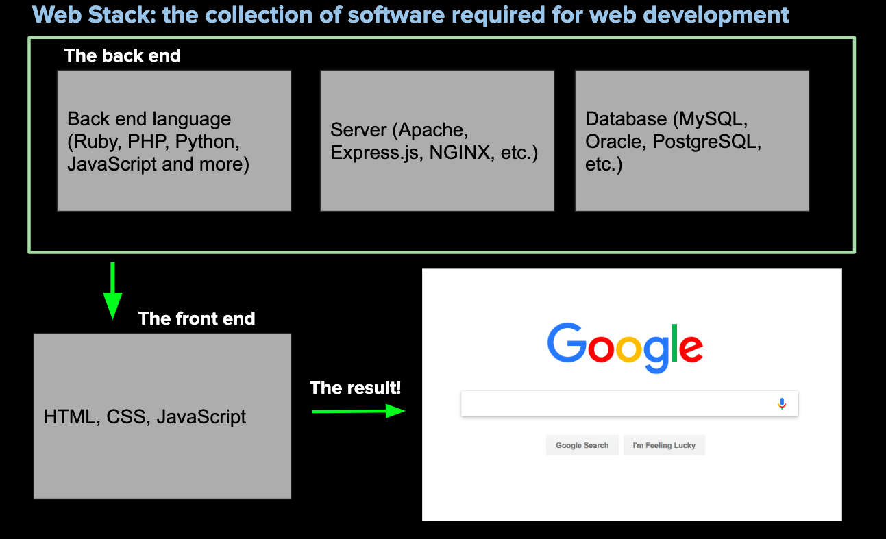
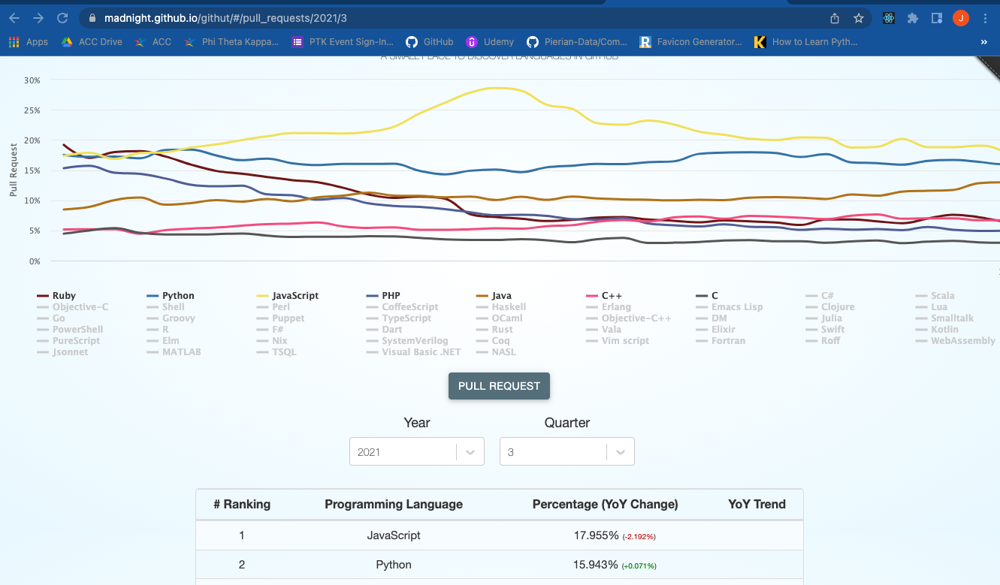
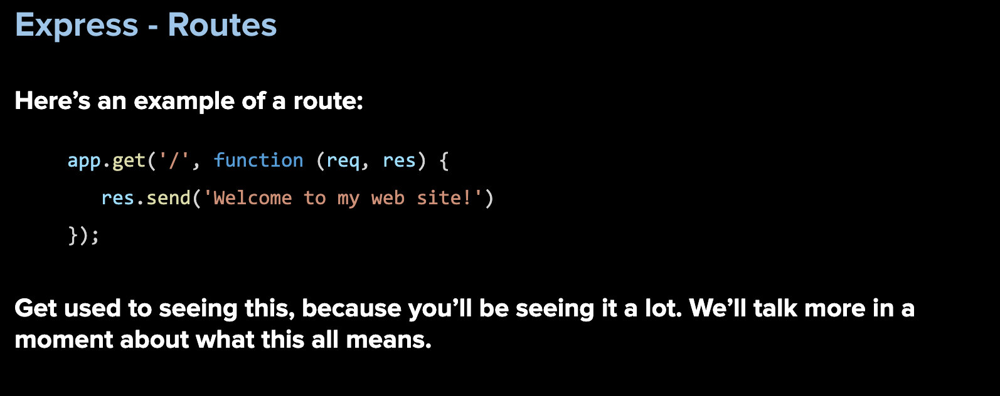
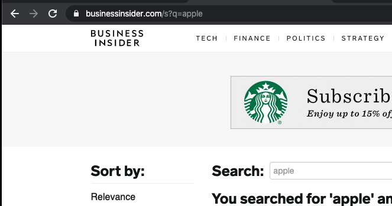
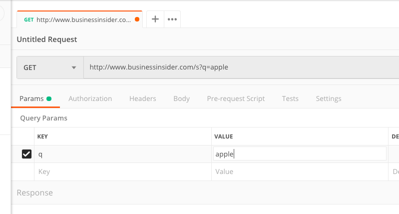
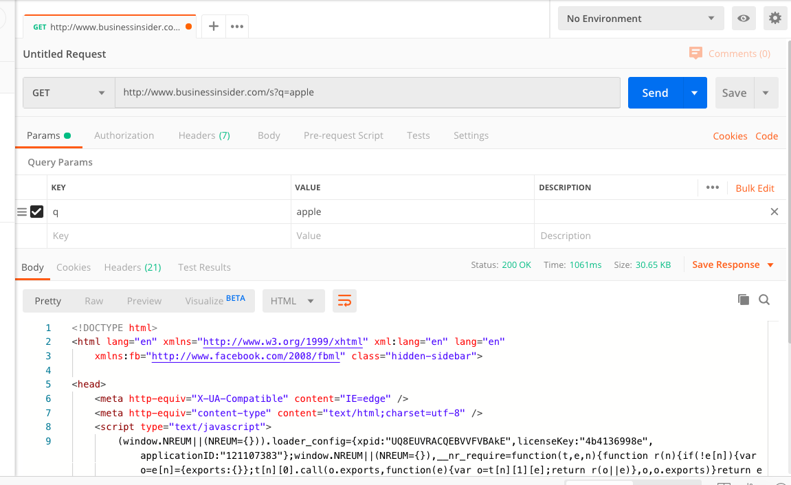

### AUSTIN COMMUNITY COLLEGE
### Web Software Bootcamp

# NODE

# Objectives:

1) How the Internet works
1) Introduction to NodeJS
1) Understand the request/response cycle
1) Introduction to Node Package Manager and node modules
1) Install Express.js
1) Build a server
1) Introduction to routing
1) Importance of package.json
1) Killing processes
1) Practice building servers and route handling
1) Using Postman to test data

# Learning Path

## <a id='_deadlines' href='#deadlines'>1. Deadlines</a>

1. 08/30/22 - NVM and Node MUST be installed based on instructions from Slack. NOTE: Without this install, you will NOT be able to do the codealongs in class.
1. 08/30/22 - Readings 1-5 MUST be done before class, especially the Node Tutorial #1.  
1. 09/1/22 - Readings 6-9 before class

  
## <a id='_readings' href='#readings'>2. Readings</a>

1.  <a id='_subRead1' href='#subRead1' style='color: blue'>How the Internet Works</a>
1.  <a id='_subRead2' href='#subRead2' style='color: blue'>ES6 and Beyond</a>
1.  <a id='_subRead3' href='#subRead3' style='color: blue'>Node Tutorial</a>
1.  <a id='_subRead4' href='#subRead4' style='color: blue'>Node - Recap</a>
1.  <a id='_subRead5' href='#subRead5' style='color: blue'>NPM</a>
1.  <a id='_subRead6' href='#subRead6' style='color: blue'>Express Tutorial</a>
1.  <a id='_subRead7' href='#subRead7' style='color: blue'>Express - Recap</a>
1.  <a id='_subRead8' href='#subRead8' style='color: blue'>Package.json</a>
1.  <a id='_subReadTask1' href='#subReadTask1' style='color: blue'>Killing a Node Process</a>

## <a id='_codervox' href='#codervox'>3. CoderVox</a>

## <a id='_projects' href='#projects'>4. Projects</a>

1. <a id='_projects' href='#project2' style='color: blue'>Project #1 - Node and NPM</a>
1. <a id='_projects' href='#project3' style='color: blue'>Project #2 - Basic Server</a>
1. <a id='_projects' href='#project4' style='color: blue'>Project #3 - Server with Pokemon</a>
1. <a id='_projects' href='#project1' style='color: blue'>Project #4 - Postman</a>

## <a id='_slides' href='#slides'>5. Slide Decks (if applicable)</a>
 
## <a id='_recommended' href='#recommended'>6. Recommended Resources</a>

1. <a id='_projects' href='#subResource1' style='color: blue'>Tech Stacks - StackShare</a>
1. <a id='_projects' href='#subResource2' style='color: blue'>Node.js Documentation</a>
1. <a id='_projects' href='#subResource3' style='color: blue'>Postman</a>
1. <a id='_projects' href='#subResource4' style='color: blue'>File Structures Cheat Sheet</a>
1. <a id='_projects' href='#subResource5' style='color: blue'>Important Commands</a>
  

# 
Readings

## 
How the Internet Works

#### <a id='subRead1' href="#_readings"> (back to top)</a>
 

We have reached a milestone having covered the topics in front end technologies! Now, we are going to explore the other side of the stack, namely back end technologies.

## TIME required - 10 minutes
In order to get a rough idea on how the internet works, watch the following video: 

[Packet: How the Internet Works](https://www.youtube.com/watch?v=ewrBalT_eBM)
 

 
Surprisingly enough, as web developers we do not need to know the nitty gritty details of how the internet works. Things such as networking layers, data transfer protocols, the TCP/IP stack, etc. are things we do not immediately need to know. 

There are whole courses and majors that are dedicated to these topics. However, we do need to know more than the average internet user.

When a user types an address into a browser, such as google.com, they are actually making a request for a website. This is known as an HTTP request. 

When a client (e.g.  a web browser or a mobile app or an IOT device), makes a request to a server, the contents of the response are then sent back to the computer that made the request. 

This is known as the **request-response** cycle.  The client makes a request, and the server sends a response.

Take the following as an example: A user runs a search on `www.google.com`.

When the user submits a URL, the first thing that happens is that your computer needs to know the exact internet protocol (IP) address to send the request to. 

An IP address looks like this .. 213.51.113.13 (4 numbers that range between 0-255 separated by periods).

All IP addresses are unique globally, just like postal addresses in cities and countries. The user's browser sends the request to the internet service provider (aka ISP), e.g. Comcast or AT&T. 

Their server forwards the request to a special kind of server called a Domain Name Server (DNS). There are thousands of DNS all over the world.  Even the ISP may have their own DNS. These keep whispering to each other and try to stay in sync with each other. 

The DNS takes the domain name (in this case, www.google.com) and translates it into an IP address: <b>23.543.35.769</b> and sends that info back to the browser.  

Your computer's operating system stores this information in its memory.  Then your computer makes another request, but this time to the IP address instead of the actual URL.

The ISP finds the fastest path possible to the Google's web server using the specified IP. As noted in the video, this is not a direct journey. 

It requires hopping from server to server until we arrive at the location we requested. And it is not a fixed journey.  It may take any of the thousands of pathways, jumping from server to server.

Once the request reaches the server, the server will figure out what we are asking for: Are you asking for the home page? The sign up page? Contact page?  It does that by reading the URL that was sent. 

The portion after the domain name tells it where to go, e.g. my Google URL for Maps may look like this ... 

https://www.google.com/maps/@30.4281169,-97.6873719,15z. 

This tells the Google web server that I am actually interested in the Google Maps product and I am currently located at the Latitude: 30.4281169 and Longitude: -97.6873719.

Hence the URL contains information on where I wanna go, and the data that I wanna send to the web server.

The server’s job is to figure this out and then builds us the right content, often pulling information from other servers and one or many databases. 

The server responds with any combination of HTML, CSS, and JavaScript. 

Below, you will notice different languages used on the back end:

Another example can be seen here:

Think of the workflow like this:

But how do we initiate this workflow? How do we handle the data once it gets back to the front end?

## 
ES6 and Beyond

#### <a id='subRead2' href="#_readings"> (back to top)</a>
 

In learning about Node and related technologies, we are going to use modern Javascript features which are collectively called ES6. We will be using this a lot.

ES6 refers to version 6 of the ECMA Script programming language. ECMA Script is the standardized name for JavaScript and ES6 is the next version after what is called ES5 or Version 5 which was released in 2011.

ECMAScript, or ES6 standards were released in June 2015. They were subsequently renamed to ECMAScript 2015. ES6 is a major enhancement to the JavaScript language, and adds many more features intended to make large-scale software development easier.

Refer back to these slides for a refresher on basic ES6:

### [JavaScript - ES6, Review, and More](https://docs.google.com/presentation/d/1xLBKQhwwsefC5bO1ffOunQdMyQx0Z6rjLyi_n0gQw8I/edit?usp=sharing)

Lastly, we are using the term ES6 but many of these ideas include ES6, ES7, etc...  

## 
Node Tutorial #1

#### <a id='subRead3' href="#_readings"> (back to top)</a>
 

Please go to the CoderVox section and watch the tutorial for Section 20 - only

DO NOT install Node based on CoderVox. Follow directions given in Slack

Time Required - 1 hour, 15 mins

## 
Node - Recap

#### <a id='subRead4' href="#_readings"> (back to top)</a>
 

We are going to focus primarily on the back-end and in order to do this, 
we are going to use Node which will allow us to build a full stack product.

NodeJS is a program that allows JavaScript to run outside the browser. So far we have seen Javascript running on a browser. 
Running Javascript on a back end server allows us to serve dynamic web pages, communicate with other servers, e.g. 
other websites and database servers, and generally act as a glue for the whole system.

 

 

        Node.js is currently the hottest, trendiest thing in web development. Remember, JavaScript originally was only designed to be run in a web browser only. Inventor Brendan Eich didn’t expect it to evolve into this massively used language

 

 

Fast forward to 2009. Node.js is invented by a programmer named Ryan Dahl. Node.js allows us to use JavaScript on any computer (not just the browser; hence it is also used on the back end), thus saving us the trouble of learning another language. This is a HUGE advantage. Before then, you had to use a language like Python, PHP, or Ruby on the back end.

  
Take a look here  (https://madnight.github.io/githut/#/pull_requests/2021/3) and see what the top language is:

#### NEXT: 

For reference, you may want to bookmark the following site:

https://nodejs.org/en/docs/

## 
NPM

#### <a id='subRead5' href="#_readings"> (back to top)</a>
 

NPM is a package manager for JavaScript, and it is a central part of Node.js. 
It is an acronym for Node Package Manager.

Packages are libraries that we use on Node.js. 
It is essentially the same idea as using Bootstrap or jQuery, except this allows us to use libraries on the 
back end.

All the packages are centralized at the NPM website. 
You can sort of think of it like the app store for Node packages.

There are over 200,000 packages available (for free!).

Everything is installed through the command line.

Check out the site: https://www.npmjs.com/ 

## 
Express Tutorial

#### <a id='subRead6' href="#_readings"> (back to top)</a>
 

Please go to the CoderVox section and watch the tutorial for Section 21 - only

Time Required - 1 hour

## 
Express - Recap

#### <a id='subRead7' href="#_readings"> (back to top)</a>
 

Express is the most popular Node web framework. It is going to be the backbone of our web applications going forward. It provides functions for pretty much everything you need to do to build a web server.

Express handles things like cookies, parsing the request body, forming the response and handling routes. It is minimalistic, versus some frameworks that give you way too much code to work with.

Why is too much code in a framework sometimes not a good thing? This potentially could be problematic because some beginner developers do not understand what is going on under the hood.

Head over to https://expressjs.com/ for more on Express.

With Express, we are going to build a back-end server that will allow us to handle routes:

 

When building a server, think of it in three parts: 

    FOUNDATION: this is where you require your modules and set most of your global variables and anything else that will be needed for route handlers

    ROUTE HANDLERS: as the name implies, these are the functions that handle routes

    LISTENER: this is the last part of your code that listens for a particular port and allows your server to handle routes

## 
Package.json

#### <a id='subRead8' href="#_readings"> (back to top)</a>
 

The package.json file contains metadata about the application. It contains information such as name, description, version number, author, etc. 

More importantly, it also contains a list of the packages that the application depends on. These are known as “dependencies”.

When we share repositories of projects, they could depend on 10, 20 or even over 100 external modules. 

Rather than uploading all of those modules, we can instead list them in the package.json file and then have other users download it themselves.

Think of this analogy to explain this: The package.json is a recipe and contains a list of ingredients needed to put the app together.

<b><em>NOTE:</em></b> Therefore, every time we create a new application with Node, we want to start including a package.json file.

We can do this manually, but there is a better way through a command called “npm init".

## 
<b id='subReadTask1'>Killing the Node Process</b>

#### <a id='subRead8' href="#_readings"> (back to top)</a>
 

### IMPORTANT: 
When working with backend technologies such as express (or servers in general), it is important to remember a couple concepts during the development phases:

1) Every time you make a change to your app.js (or whatever you have called your server file) you MUST stop the node process and restart it.

2) You can do this by holding down the control key on your computer and tapping the c key <b>(CTRL + C)</b>. This will stop the node process from running.

3) Restart your node process as you have previously done.

4) If you are trying to run your node process and you get an error similar to  this:

    `Error: listen EADDRINUSE`

This means you have a server currently running on that current port. You need to find where that process is running and stop it.

    a) Go to your terminal and type the following command where app.js represents the file you believe is running (could be index.js or server.js): 

            ps aux | egrep app.js

    b) This will give you a list of files currently running that match ‘app.js and look something similar to this’:

    What you are looking for is the process number that is running. In the above example you will see 1432 and 1473. If you look at the time stamps, you will see at 6:49pm is when you ran the egrep command which means the other process is probably the one you want.

        NOTE: you may have MANY files that end up in your results and may take you more time to figure out the correct process

Use the following command to end the process:

	kill 1432

You should now be able to restart the app you want.

For more detailed information, please refer to   

https://www.linux.com/tutorials/how-kill-process-command-line/  

for a quick tutorial on killing processes. 

# 
Slide Decks

#### <a id='slides' href='#_slides'>(back to top)</a>

These slides are for reference only and will not necessarily be used in class:

1. [NodeJS - Intro, HTTP, Postman](https://docs.google.com/presentation/d/1PEj8ur1PUaJpEUTmKUL3xDPy5ZfAKjWXXyNGVINgC7Q/edit?usp=sharing)
1. [NodeJS - NPM, node modules, Express, Routing](https://docs.google.com/presentation/d/1whYK9Oww5EdqBRdCiCHYkp-6qBVsumPmVS5tI21GYUQ/edit?usp=sharing)
1. [NodeJS - Routing, EJS](https://docs.google.com/presentation/d/1A1vj3-6vx9vlw3mdlvV-KrCDzcgPnjpBL3IzuInM4vs/edit?usp=sharing)
1. [NodeJS - Control flow, Partials, CSS](https://docs.google.com/presentation/d/1pcr8QooPaq6eHRbKV7xN9mRijC-MXdU9jsnkB4sjFL8/edit?usp=sharing)

# 
CoderVox

#### <a id='codervox' href='#_codervox'>(back to top)</a>

## Tutorial
<h2 style='color: red'>TIME REQUIRED - See individual readings for required time</h3>

### [CoderVox](https://codervox.com/p/the-online-web-developers-bootcamp/?product_id=2625725&coupon_code=READYTOLEARNONLINE)

# 
Projects

There are three projects that will help you gain a better understanding of Node and the dev tools to be used when working on the backend.
There is no front-end, so most of these projects are done with dev tools and your terminal.

## 
Project #1 - Node and NPM

#### <a id='project2' href="#_projects"> (back to top)</a>
 

The objective here is to learn the basics of Node.js. We are going to use Node.js which you should have already installed on your laptop and now we are going to get some practice using NPM. We will ll be using NPM to install packages in our applications, so this will be useful for us very soon.

Create a new parent folder called `npmProjects`. We will be using it for all of the tasks in this project.

#### Task #1 : NPM INIT
This task is designed to help you gain some experience with using the package.json file. Review the documentation for package.json here: https://docs.npmjs.com/getting-started/using-a-package.json

Create an empty folder and cd into it in your terminal. Run npm init. It will ask you to fill out some data regarding your application.

Be familiar with what each field requires and what they mean.

Repeat the same process by creating another blank folder, and running`npm init` again.

You may delete these folders.

Going forward, until further notice, you should ALWAYS use npm init when building an application that uses NodeJS.

#### Task #2 : HEARTS

Here is a fun and simple NPM package you can use to create ASCII hearts in your terminal!

1. Take a look at this package: https://www.npmjs.com/package/ascii-heart

2. Read the documentation.

3. Create a folder called <code>HeartsProject</code>

4. cd into that folder.

5. Create a file called “index.js”. 

6. Run <code>npm init</code> (NOTE: last reminder to do this.)

7. Put your code in there, and get some hearts displaying in your terminal!

8. Try the parameters. Try making bigger and smaller hearts.

9. Use different characters.

#### Task #3 : Marvel Characters
Here is another simple package that allows you to randomly get a marvel character name:

1. Check out the documentation for marvel-characters pack here:
https://www.npmjs.com/package/marvel-characters 

2. Read the documentation.

3. Create a folder called <code>SuperProject</code>

4. cd into that folder.

5. Create a file called “index.js”. 

6. What do you do here..........??? Do not forget!!!

7. Install module locally NOT globally. DO NOT use the global flag (-g).

8. Write code in index.js that will:

        a. Get a random character to show in the terminal.

        Using various array methods:

        b. Display the number of characters in the database

        c. Display only characters whose names start with "Man" in your terminal, or an error message if does not exist.
        
        d. Display “Iron Man” in your terminal, or an error message if does not exist

        e. Display “Batman” in your terminal, or an error message if does not exist

9. Results should look something similar to this: 

        🐺  SuperProject:$ node index.js 
        Maria Hill
        # of characters in the db:  1252
        [
        'Man-Thing',
        'Man-Wolf',
        'Mandarin',
        'Mandrill',
        'Mandroid',
        'Manta',
        'Mantis'
        ]
        [ 'Iron Man' ]
        No matches found

#### Task #4: CASUAL
1. Navigate to this package: https://www.npmjs.com/package/casual

2. ‘Casual’ is a fake data generator. It generates random names, addresses, etc. for us quick and easy! <b>NOTE:</b> great to use later on for generating fake data for a database.

3. Read the documentation.

4. Create a file called index.js. 

5. Create a simple program that outputs the following statement in the terminal. Use casual to create the (fake data):

        Hello there (name)! 
        How was your trip to (country)? 
        Did you get to visit (city)? 
        I sure do hope you had a wonderful time. 
        Is your phone number still (phone number)?
        I will try to give you a call sometime. By the way, I want to send you a fresh loaf of bread at your address of:
        
                (address). 
                
        Well, I will see you soon. I will be visiting sometime before (month). 
        Until then, farewell!

#### Task #5: LOG.PETS & ANIMALS

Check out both https://www.npmjs.com/package/log.pets and https://www.npmjs.com/package/animals

1. Create a folder called AnimalsProject with a file called index.js and use npm to install both packages.

2. Get a random animal's name to appear in the console using the “animals” package.

        🐺  AnimalsProject:$ node index.js 
        rook
        🐺  AnimalsProject:$ node index.js 
        guinea-pig
        🐺  AnimalsProject:$ node index.js 
        cheetah

3. Get a lion ascii art to appear using the “Log.pets” package.

        AnimalsProject:$ node index.js 
        horse
                  .~ ~ ~.
                (  o,,,o  )
               (   ). .(   )
                \  { v }  /
                  ~ `v' ~

4. Can you use them both together so that the animal names from the “animals” package appear on the zoo sign from the Log.zoo method in the “Log.pets” package.

It should look something like this in your terminal (different names each time you run): 

5. Can you display the number of animals available for the generator?

        # of animals in generator: ????

6. Using array methods, how many animals start with the letter 'G', or display an error message if none found?

        # of animals starting with G:  No matches found

7. Using array methods, and the "G" from above, how can you display number of animals starting with that letter, or display an error message if none found?

        # of animals starting with G:  19

#### BONUS Task #6: READLINE-SYNC part 1

1. Go to this package: https://www.npmjs.com/package/readline-sync

2. Read the documentation. 

3. Install and use it.

4. Using node and the readline-sync package, create a JavaScript file that asks three questions in the Terminal:

        “What is your name?”

        “What is your favorite food?”
        
        “What is your favorite drink?” 

5. When you run the file, the program should respond with the sentence:

        “Hi ____, your favorite food is _____ and your favorite drink is ____.”

#### BONUS Task #7 : READLINE-SYNC part 2

1. Using node and the readline-sync package again, create a JavaScript file that asks,

 	    “How spicy would you like your tacos?”

2. The user should be presented with a list of choices:

        'spicy', 
        'very spicy', and 
        'so spicy, you won't be able to feel your face'.

3. The terminal should then respond with the question:

        “Ok, so you want your tacos to be ____. Are you sure about this?” 

4. The user should then be given the choices to respond, 'yes' or 'no'.

5. If they choose 'yes', the output should be:

        Ok, we will have your order right out.

6. If they choose 'no', the output should be:

        What’s the matter? Can't handle the heat?

<b>NOTE:</b> you’ll want to use the built-in keyInSelect method in readline-sync to do this task. Refer to the documentation for an example.

## 
Project #2 - Basic Server

#### <a id='project3' href="#_projects"> (back to top)</a>
 

Practice building a Basic Server until you can do it without looking. The goal is to be able to build a server in less than 3 minutes.

When you can build one without looking, push it to github and add this to the top of your `index.js` file:

"I was able to build this without looking on my \<number> attempt!"

## 
Project #3 - Server with Pokemon

#### <a id='project4' href="#_projects"> (back to top)</a>
 

Build a basic server.
You are also going to need the <a href="https://www.npmjs.com/package/pokemon">Pokemon</a> module from NPM. 

Make sure it has the following route handlers:

1) "/" and send back a response with a string: "I am the Pokemon root route."

1) "/pokemon" and send back a response of a random pokemon. Doublecheck this is working by resending the request (refreshing the browser/Postman) mutiple times

1) '/dex' and send back a response that is an array of 5 pokemon - representing our Pokedex

1) 'pokemon/dex' and send back a response that is an array of 5 Pokemon BUT each element is an object that includes:

        1. Name of Pokemon: String
        2. Attack - random number (50 - 100)
        3. Defense - random number (0 - 100)

        Each object will look similar to this:
        { 
                pokemon: 'Bulbasaur',
                attack: 45,
                defense: 88
        }

1) '/battle' will send back a "winner" and a 'loser" between two Pokemon.  
You will need to come up with some sort of logic and determine between two pokemon (built using same process as above) who would win.   
You could compare attack versus defense, or just attack, or any way you want. Have fun with it.

Send back a string (similar to below) that states the name, attack and defense of the winner and the loser:

        And the winner is Tepig with an attack of 76 and a defense of 3 versus Espurr who has an attack of 99 and a defense of 40

Test all these routes with a browser.

Then test them again using Postman

## 
Project #4 - HTTP Requests with Postman

#### <a id='project1' href="#_projects"> (back to top)</a>
 

It is important to understand request-response cycles and how computers communicate with each other. This exercise will help you gain a fundamental understanding of that.

We will be using a tool called ‘Postman’. It will let us make HTTP requests and view responses. It works kind of like a web​ ​browser, but for our purpose, it will allow us to see how​ ​the cycle of requests and responses work.

1. Go to getpostman.com (see <a href="#postman">RESOURCES > Postman</a> for more info)

2. Download/Install the app (either the Chrome or Mac app)

3) Open the app.

4) Take a moment to familiarize yourself with the application. Notice it slightly resembles a web browser.

5) Type in a URL (such as http://www.costco.com​ ) and press the blue send button. What do you get back?

6) Notice the drop down option to the left of the URL bar that says “GET”. What are the other options when you click on it?

7. These tell the server what kind of request we are making. ‘GET’ and ‘POST’ are the most commonly used requests. If we are just retrieving information, we use a GET request. If we are sending some data, such as signing up as a new user on a social network or commenting on a news article, we are making a POST request. PUT and PATCH requests are used for updating information, such as if you were editing a post. A DELETE request is used when you want to delete something from the database. There are more types of requests, but these are the most commonly used ones.

8. Click on the tab that says ‘headers’. Notice that after we request a page, we also get back additional information, such as date, language, etc.

9. While you are still in the headers tab, take note of the status code on the right side. You should see “Status: 200 OK”.

10. HTTP​ ​status​ ​codes are a big piece of HTTP requests. Perhaps you’ve heard of 404 Not Found. There are many different status codes, and it’s good to familiarize yourself with what their purpose is. You don’t need to memorize them, but you should know what their function is.

11. Now let’s try this. Go to businessinsider.com/s on your web browser, not Postman. Locate the search icon at the top right.

12. When the search box appears, search for ‘apple’ and press enter.

13. When you get back your list of search results, take a look at the URL field. It will look something like this: 

    

14. Notice what was added to the end of the URL. This is a URL parameter consisting of a key and value. The “q” is the key, and “apple” is the value.

15. Let’s go back to Postman. In the URL field, type in this url: http://www.businessinsider.com/s​ (notice there is an ‘s’ at the end of this url.)

16. Click on the ‘params’ tab under the URL field.

    

17. Now we have an area to type in some params. On the first row, let’s put ‘q’ into the key, and ‘apple’ as the value. 

    

18. Then hit send.

18. We get back the search request from BusinessInsider in the form of HTML. As it turns out, we can make GET requests and pass information along in the URL with parameters. 

    

That’s it! The key takeaways from this project are the different kinds of requests we can make, status codes, and how we use URL parameters.

# 
Recommended Resources :

## 
Tech Stacks - StackShare

#### <a id='subResource1' href="#_recommended"> (back to top)</a>
 

Take a look at stackshare.io in order to see how what types of technology stacks companies use:

        https://stackshare.io/airbnb/airbnb

        https://stackshare.io/pinterest/pinterest

        https://stackshare.io/netflix/netflix

Notice anything? Recognize any of the technologies? You should see some of the same technologies you have been learning as well as a few you will learn in the near future.

## 
Node.js Documentation

#### <a id='subResource2' href="#_recommended"> (back to top)</a>
 

Please bookmark for futher reference:

[Official Node Documentation](https://nodejs.org/en/docs/)

## 
Postman

#### <a id='subResource3' href="#_recommended"> (back to top)</a>
 

To help us learn about HTTP requests, we’re gonna use a tool called ‘Postman’.

The website is https://www.getpostman.com/

Go ahead and install it now.

Postman allows us to make HTTP requests and view responses. It helps developers understand how things work, as well as debug (especially if data doesn’t come back the way you were expecting).

Notice that there is a drop down menu. These are the HTTP verbs, and we can choose what type of request we want to make. The most commonly used requests are GET, POST, PUT, and DELETE. 

Let’s talk briefly what each of these mean.

<b>GET</b> - Retrieves information, like a home page

<b>POST</b> - Sends data in your request, such as when you sign up for a website, or want to store information in a database

<b>PUT</b> - Update or edit information. (Updating your email address, editing a post, etc.)

<b>DELETE</b> - Delete something (deleting a message, post, etc.)

## 
Cheat Sheet

#### <a  id='subResource4' href="#_recommended"> (back to top)</a>
 

<b>FILE&nbsp;&nbsp;STRUCTURES</b> (order may vary):

	Basic Backend (server):
		PARENT FOLDER
                index.js
                package.json
                package-lock.json
                node-modules (folder)

## 
Important Commands

#### <a id='subResource5' href="#_recommended"> (back to top)</a>
 

<b>(CTRL + C)</b> - kills a running process

<b>node app.js</b> - starts the server; if there are any changes to app.js then user must kill the process and then restart

<b>nodemon app.js</b> - starts the server; user does not need to restart the server if there are any changes to app.js

<b>npm init</b> - creates a package.json file to be used by the server as a ‘blueprint’ on how to run the server file

<b>ps aux | egrep app.js</b> - command line statement that allows the user to discover which processes are running in terminal	

<b>rs</b> - forces a restart of nodemon

