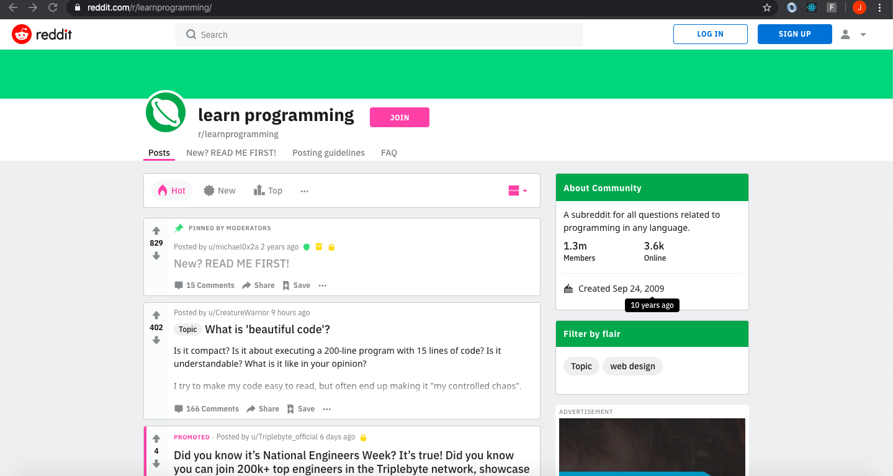
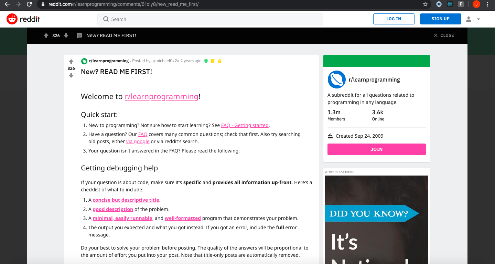
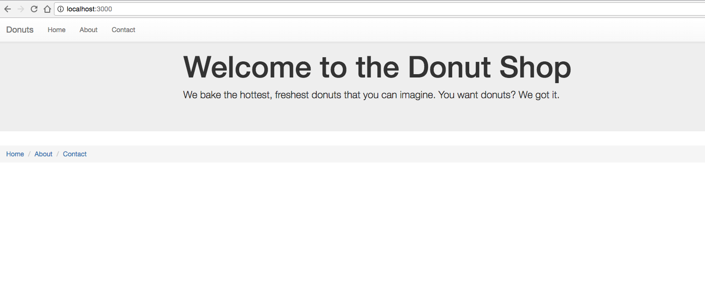
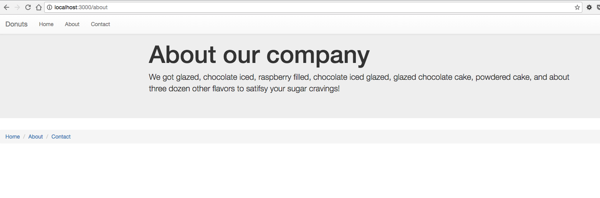
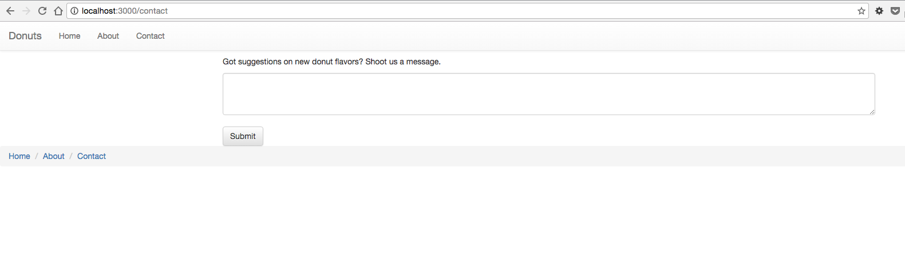
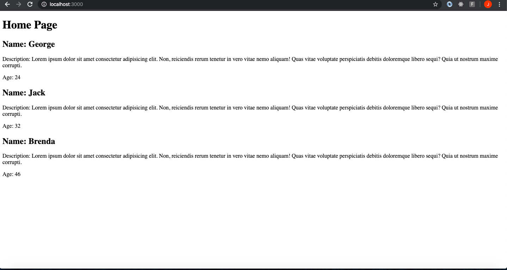
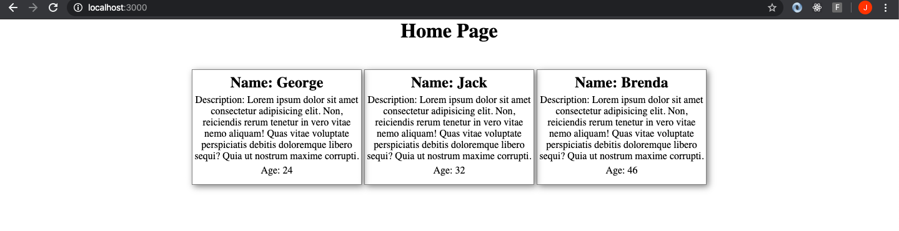

<center>

### AUSTIN COMMUNITY COLLEGE
### Web Software Bootcamp

# EJS

</center>

# Objectives:

1) Route Handling with parameters
1) What is templating?
1) See how Node works with EJS
1) Importance of res.render
1) Practice building basic apps for backend
1) Concept of a public folder
1) Using partials
1) Projects

We will now learn about Node.js and a templating library called EJS. 

EJS stands for embedded JavaScript. 

We use it for templating, and it will make our web applications more dynamic. No more static web pages!  

With EJS, JavaScript code is embedded in an HTML document.

The node server converts the JS into HTML markup and sends (renders) the generated HTML to the client browsers. 

<hr><hr>
<center>

# Learning Path

</center>

## <a id='_deadlines' href='#deadlines'>1. Deadlines</a>

1. 09/03/22 - Readings #1 and #2 before class
1. 09/08/22 - Readings #3 and #4 before class
1. 09/08/22 - should be done with all NPM projects
1. 09/10/22 - Readings #5 and #6 before class
1. 09/19/22 - should be done with EJS projects
  
## <a id='_readings' href='#readings'>2. Readings</a>

1.  <a id='_subRead1' href='#subRead1' style='color: blue'>Routing</a>
1.  <a id='_subRead2' href='#subRead2' style='color: blue'>Route Parameters</a>
1.  <a id='_subRead3' href='#subRead3' style='color: blue'>EJS Tutorial</a>
1.  <a id='_subRead4' href='#subRead4' style='color: blue'>Templating</a>
1.  <a id='_subRead5' href='#subRead5' style='color: blue'>EJS</a>
1.  <a id='_subRead6' href='#subRead6' style='color: blue'>EJS - Partials</a>

  
## <a id='_codervox' href='#codervox'>3. CoderVox</a>

## <a id='_projects' href='#projects'>4. Projects</a>

1. <a id='_projects' href='#project1' style='color: blue'>Project #1 - Intro to EJS</a>
1. <a id='_projects' href='#project2' style='color: blue'>Project #2 - Passing Data</a>
1. <a id='_projects' href='#project3' style='color: blue'>Project #3 - Partials</a>
1. <a id='_projects' href='#project4' style='color: blue'>Project #4 - BONUS - Cards</a>

## <a id='_slides' href='#slides'>5. Slide Decks (if applicable)</a>
 
## <a id='_recommended' href='#recommended'>6. Recommended Resources</a>

1. <a id='_projects' href='#subResource1' style='color: blue'>Cheat Sheet</a>
1. <a id='_projects' href='#subResource2' style='color: blue'>Terminology</a>
1. <a id='_projects' href='#subResource3' style='color: blue'>EJS Documentation</a>

  
<hr><hr>

# <center>Readings

## <center>Routing</center>
#### <a id='subRead1' href="#_readings"> (back to top)</a>
<br>

So far, you have seen how you can build basic routes and depending on which one you select, you will get a different page or response. 

You know how to define routes using Express. 

You know that ‘/’  , ‘/kiwi’  , and ‘/strawberry’  are all routes that can have different responses for the user. But what happens if a user types in a url that is not established? 

Luckily, there are ways to do all of the above.

What will happen if you type in: doggycat.com in your browser? You probably will get re-routed to a hosting site that offers a special on domain names. 

But what if your server is running and you try <b>localhost:3000/doggycat</b>? You should be getting some kind of error. The reason is that these routes DO NOT exist.

As a developer, you have to account for the lowest common factor of your users. 

They WILL break your site, either by accident because they typed something in wrong, or on purpose because they are trying to hack your info. You need to plan for this.

Assuming you have your server listening for port 3000, and you have a home page, about page, and a contact page, you probably have route handlers listening for something like this:

    app.get("/home", function (req, res) {
        res.send("You have reached the Home Page!")
    })

And so on for each of the other two routes. But you need to add one more route, for now.

    app.get("*", function (req, res) {
        res.send("Sorry, the page you are looking for does not exist.")
    })

This can be used as a catch-all for all routes that do not currently have a handler. Note that this is a last resort handler, meaning if all other handlers do not recognize the route submitted by the user, then it will be triggered. 

Therefore, the “*” route handler needs to be placed AFTER all other route handlers and BEFORE the listener.

<hr>

## <center>Route Parameters</center>
#### <a id='subRead2' href="#_readings"> (back to top)</a>
<br>

Being able to handle routes is great if you know exactly what the route is going to be. But what if you needed more flexibility with your routes? What if you want the route to include the name of the user? How will you be able to prepare route handlers for every name ever used since the beginning of time. 

You can not. So you have to find a way to account for every name that has ever existed. You can do this with route parameters.

In order to get a better understanding of how to use parameters, you can take a look at Reddit. Reddit is an online message board with many subreddits, or forums that focus on various topics of interest. Look at this example at by going to 
<b>reddit.com/r/learnprogramming</b>



Go to a few other forums. What do you start to notice about the urls?

The route for every subreddit begins with the base url, also known as the root route - <code> reddit.com </code> followed by <code>/r</code> and then the name of the topic.

The subreddits are created by users of the website. Does this mean that the developers of Reddit have every possible route handler pre-written inside the code? 

No. This would be almost as impossible as trying to account for every name in the world mentioned above. So how do you make this work:

    reddit.com/r/learnprogramming
    reddit.com/r/dogs
    reddit.com/r/comics

See the pattern? What if you could use a variable of some kind to hold the name of the topic? What happens if you click on one of the comments:



Click on a few more.
	
    https://www.reddit.com/r/learnprogramming/comments/61oly8/new_read_me_first/
    https://www.reddit.com/r/dogs/comments/ea4ih6/photo_friday_warm_and_cozy/
    https://www.reddit.com/r/comics/comments/ea2ji8/swords_a_doomsday_sword/

See another pattern?

    /r/subreddit/comments/id/title

In building a route handler with Express, you would probably start with something like this:

	app.get("/r/subreddit/comments/id/title",
    function(req, res){
        <code>
    });

What issue do you see? This route handler is looking for a specific route:

	/r/subreddit/comments/id/title

This is not what you want. What you are looking for is a way to handle different subreddits, ids, and titles. This can be done by using subreddit, id and title as variables. 

These are variables so you can call them whatever you want, but you want your code to be understood by others, so they should be related to what the data/values you are trying to obtain. You can accomplish this by adding a colon (:).

    /r/:subreddit/comments/:id/:title

These variables are called parameters when used in the urls. These parameters can be used to hold dynamic values and used later for other purposes. Your route handler would look like this now:

    app.get("/r/:subreddit/comments/:id/:title",
        function(req, res){
            <code>
    });

Now we want to access these values. You do this by using the req object discussed in the last module. 

Remember, req and res are objects that contain data for all incoming requests and outgoing responses. 

You can use a route handler and console log to get a better idea of what is in the req object. 

Recall how you can access a value in an object - by name. 

Therefore, in order to get access to the values in your url, you need to use req.params. But you need to drill a little further down. 

Assume, the url the user wants is:

	/r/cats/comments/123/more_info

When using parameters, you are basically creating an object. In this case, with :subreddit, you are creating an object called subreddit with a value of cats.

	{ subreddit: “cats” }


If req is an object with the value of the params object, and params is an object with value of the subreddit object, how do you drill down to the value of the subreddit object?

    req: {
        params: {
            subreddit: “cats”
        }
    }

If you want the value of `:subreddit`, you would use `req.params.subreddit`

<hr>

## <center>EJS Tutorial</center>
#### <a id='subRead3' href="#_readings"> (back to top)</a>
<br>

<h3>TIME REQUIRED - 1 hour, 25 min</h3>

Please go to the CoderVox section and watch the tutorial for Section 22 - only

<hr>

## <center>Templating</center>
#### <a id='subRead4' href="#_readings"> (back to top)</a>
<br>

You have now worked with routes and parameters in a way that allows for customization of your page. But what if you want your page to be more dynamic? To change or have different data displayed depending on who the user is? 

So far, you have sent strings back with your route handlers, but what else can you send back? You could send back HTML:

    app.get("/", function (req, res) {
        res.send("<h1>Welcome to the home page!</h1>")
    })

But this is quite impractical. What if you need to send a whole HTML page back, with data that changed every time depending on the user? This is where templating comes in handy.

Templates are a great way to allow data to be passed from the backend to the browser and allows for customization as needed. You can add logic inside your HTML pages. Yes, this means you can use JavaScript inside your HTML such as loops, conditionals, and other language specific constructions. 

One of the challenges with templating is that each engine has its own syntax which can be confusing at first glance:

<center>

### Mustache.js
</center>

        {{#movies}}

        * {{title}}

        {{/beatles}}

<center>

### Handlebars.js
</center>

        <h1>By {{fullName author}}</h1>
<center>

### Pug
</center>

        let movie = { title: 'Avengers' }
        #container
            if movie.title
                h1 Title
                p#title = movie.title
            else
                h1 Title
                p#title No movie title available

<center>

<hr>

## <center>EJS</center>
#### <a id='subRead5' href="#_readings"> (back to top)</a>
<br>

### EJS
</center>

        <% posts.forEach(function(data){ %>
            <p><%= data.title%> by <%= data.author%>.</p>
        <%})%>

The other benefit of templating is that it can speed up the process on the front end allowing for dynamic content. How is this done?
 
There is a method in Express called `res.render`. This allows you to render a separate file that contains all the front end HTML, CSS, and JavaScript in one file. 

However, your goal is not to render up static HTML files but rather to render dynamic pages that are flexible and useful. You can do this with only JavaScript files; no need for HTML pages. 

But before you can work on this, it is important to understand some of the ‘under the hood’ workings of `res.render`.

Start here: http://expressjs.com/en/5x/api.html#res.render
 
What does this mean to you? There are some huge concepts that need to be addressed before you can continue.

Assume you have a file called <code>home.ejs</code> with the following one line of HTML code:
 
	<h1>I am the Home page!</h1>
 
and you are using the following route handler:

    app.get("/home", function (req, res) {
        res.render("home.ejs");
    })
 
What do you expect to happen?

If you think you would see a page displayed with the words “I am the Home page!” in your browser, you would be correct. Keep in mind, you have not set up your files correctly to see this, nor do you have a server that can handle these requests so you can not test this, yet.
 
 
The first concept is that templating engines are run on the backend. There is a misconception that if you are using HTML, which you saw above, then this is happening on the front end. Incorrect. 
 
Ask yourself, where is the javascript being used to run the server? Your answer should be ‘on the backend’ or ‘in my index.js file.’ 
But if you have a file (i.e., example.pug, example.ejs) that is being rendered, is this not on the front end? No. These are all being rendered on the back end.

On the backend (`index.js`), your server is listening on port 3000 and waiting for the user to go to the `localhost:3000/home` url:

    app.get("/home", function (req, res) {
        res.render("home.ejs");
    })

When this happens, the server is going to render the “home.ejs” file: 

This looks like HTML, but in reality, it is javascript (i.e., .ejs and .pug extensions indicate this) that needs to be <u>interpreted</u> as HTML and then displayed in the browser. In fact, it is referred to as JSX (JavaScriptXML):

    <h1>I am the Home page!</h1>

The user will only see this in the browser:

    I am the Home page!

Please note, this is ALL happening on the backend with the server and .ejs files. <b>NOTHING</b> is happening on the front end. It just looks like it is.

The second concept to get familiar with is the idea of ‘`views`.’ 

When working with `.render()`, by default, it is looking for a ‘views’ folder. 

You can reconfigure this if you like (https://expressjs.com/en/guide/using-template-engines.html), but for your purposes, you are going to leave the default settings which means you have to do nothing except create an actual “views” folder to hold your template files. Your file structure will end up looking something like this:

    PARENT FOLDER
            index.js
            package.json
            package-lock.json
            node-modules (folder)
            views (folder)
                home.ejs

By default, Express is not going to automatically connect to the public folder. You have to tell it to do this. Inside your app.js file, add the following code whenever you are going to use static files:

    app.use(express.static('public'));

Static files may include HTML, CSS, images, documents, or other javascript (.js) files. This tells Express where to look for these assets. 

For more detailed information, please check out docs here: <u>https://expressjs.com/en/starter/static-files.html</u>

<b>NOTE:</b> if you do not put these assets inside a public folder and use the code above, you WILL not be able to access them. Also, these files will all be available to anyone who has access to your code through the browser so when designing your application, you do not want any confidential or private information to be stored here. 
<hr>

## <center>EJS - Partials</center>
#### <a id='subRead6' href="#_readings"> (back to top)</a>
<br>

One of the benefits of using EJS (and other templating engines) is the ability to think of files as reusable components. 

For instance, you have an application composed of 10 HTML pages and each one needs to have a footer. This footer is composed of a breadcrumb navbar as well as copyright info and details about your company. 
Normally it takes you about an hour to build the footer. You copy and paste the footer into each of the pages and you are ready to go on vacation. 

But just as you are about to walk out the door, your boss notices that you have many typos, the margins are off for spacing, as well as some font issues. 
Now you have to go back to your footer on one of the files, fix your code, then delete the footers from the other nine pages and copy the new code. 

Too bad your plane leaves in an hour.

With EJS, you can make the changes in one place and <b>ALL</b> 10 pages will automatically be updated. You can do this with partials. 

What this means is that you can write code in a file you will call `footer.ejs` and place inside a folder called `partials`. You can then reference this file with an include statement within all 10 of your files.

When using partials your file structure will end up looking something like this:

        PARENT FOLDER
            index.js
            package.json
            package-lock.json
            node-modules (folder)
            views (folder)
                home.ejs
                partials (folder)
                    header.ejs
                    navbar.ejs
                    footer.ejs

In order to use the `footer.ejs` file, you would write the following code inside your `home.ejs` file:

        <h1>This is my Home page!</h1>
        <%- include('partials/footer'); -%>

When this file is rendered, it would include any code from the `footer.ejs` file. But you can go even further and include a `header.ejs` file:

        <%- include('partials/header'); -%>
        <h1>This is my Home page!</h1>
        <%- include('partials/footer'); -%>

What would be in the header? 

Remember, even though this is all happening on the backend, the code will be evaluated as HTML. 

How do you build a basic HTML page? Doctype? Language? Body? Head? Title? Where are you linking up your stylesheet? Using Font Awesome? 

This is done like you normally would, only now you are dividing the HTML code between three files - header.ejs, home.ejs, footer.ejs.

## NOTE:
 The syntax for ejs `include` is different than when we are evaluate a variable. Instead of an equal sign(`=`), you must use a minus sign (`-`). 
### KNOW THIS!!!!

<hr>

Assume this is your original code for work:

    <!DOCTYPE html>
    <html lang="en">
        <head>
            <meta charset="UTF-8">
            <meta name="viewport" content="width=device-width, initial-scale=1.0">
            <meta http-equiv="X-UA-Compatible" content="ie=edge">
            <title>Document</title>
        </head>
        <body>
            <h1>This is my Home page!</h1>
            <footer>
                <div>
                    <h1>Stuff</h1>
                    <small>&copy;Copyright</small>
                    <h3>How to contact me</h3>
                </div>
            </footer>
        </body>
    </html>

Now divide it into 3 parts:

<code>header.ejs</code>

        <!DOCTYPE html>
        <html lang="en">
            <head>
                <meta charset="UTF-8">
                <meta name="viewport" content="width=device-width, initial-scale=1.0">
                <meta http-equiv="X-UA-Compatible" content="ie=edge">
                <title>Document</title>
            </head>
            <body>

<code>home.ejs</code>

            <h1>This is my Home page!</h1>

<code>footer.ejs</code>

            <footer>
                <div>
                    <h1>Stuff</h1>
                    <small>&copy;Copyright</small>
                    <h3>How to contact me</h3>
                </div>
            </footer>
        </body>
        </html>


Whenever you need the header or footer, you include them:

        <%- include('partials/header'); -%>

or:

        <%- include('partials/footer'); -%>

Any changes you make in the header or footer files will automatically affect all files which have included them.

<hr><hr>

# <center>Slide Decks

#### <a id='slides' href='#_slides'>(back to top)</a>

These slides are for reference only and will not necessarily be used in class:

1. [NodeJS - Intro, HTTP, Postman](https://docs.google.com/presentation/d/1PEj8ur1PUaJpEUTmKUL3xDPy5ZfAKjWXXyNGVINgC7Q/edit?usp=sharing)
1. [NodeJS - NPM, node modules, Express, Routing](https://docs.google.com/presentation/d/1whYK9Oww5EdqBRdCiCHYkp-6qBVsumPmVS5tI21GYUQ/edit?usp=sharing)
1. [NodeJS - Routing, EJS](https://docs.google.com/presentation/d/1A1vj3-6vx9vlw3mdlvV-KrCDzcgPnjpBL3IzuInM4vs/edit?usp=sharing)
1. [NodeJS - Control flow, Partials, CSS](https://docs.google.com/presentation/d/1pcr8QooPaq6eHRbKV7xN9mRijC-MXdU9jsnkB4sjFL8/edit?usp=sharing)


<hr><hr>

# <center>CoderVox</center>

#### <a id='codervox' href='#_codervox'>(back to top)</a>

## Tutorial
<h2 style='color: red'>TIME REQUIRED - See individual readings for required time</h3>


<center>

## Link  -> [CoderVox](https://codervox.com/p/the-online-web-developers-bootcamp/?product_id=2625725&coupon_code=READYTOLEARNONLINE)

</center>

<hr><hr>

# <center id='projects'>Projects</center>

## <center>Project #1 - Intro to EJS</center>
#### <a id='project1' href="#_projects"> (back to top)</a>
<br>

We will practice rendering EJS files with express.js.

#### Set up:

1. Create a blank folder.

1. Create an `index.js` file.

1. Run `npm init` and install `express.js`.

1. Also install the EJS module with `npm i ejs`. 

1. Create a `views` folder in your application. Express will automatically look for your templates in there.

### Project Tasks

1. Create three pages with EJS
    * home, with route `localhost:3000/`
    * about, with route `localhost:3000/about`
    * contact, with route `localhost:3000/contact`

1. Create headings as follows
    * On the home page, create an `h1` that says “Welcome to the home page!” 
    * On the about page, create an h1 that says “Welcome to the about page!” 
    * On the contact page, create an h1 that says “Welcome to the contact page!”

1. Next we will be passing variables from your `index.js` file to your rendered template pages.  In app.js, create three variables: 
    * one variable called ‘pizza’ with a value that contains the string ‘I like my pizza with extra pineapple.’ 
    * one variable called ‘cappuccino’ with a value that contains the string ‘I like my cappuccino to be sweet.’
    * another variable called ‘fries’ with a value that contains the string ‘I like my fries crispy with extra salt.’

1. Now using EJS tags, you must render the contents of these variables onto the home, about, and contact page. 
    * The home page should render the pizza variable, 
    * The about page should render the ‘cappuccino’ variable, and 
    * The contact page should render the fries variable. It should look like the following:


      
      
      

    You will still be using Express' render method to load up these EJS templates. 

    In order to send variables to other pages, you have to send a JavaScript object as an argument to the render method.

<hr>

## <center>Project #2 - Passing Data</center>
#### <a id='project2' href="#_projects"> (back to top)</a>
<br>

1. Once again, create a blank folder. Create an `index.js` file. Run npm init and install express.js. Also install the EJS module with “npm install ejs”. Create a ‘views’ folder in your application. In the views folder, create a file called `messages.ejs`.

1. In your index.js file, create an array of objects that looks like this: 

    ```
    let messages = [
       {name: "Jim", message: "Hi, how are you?"},
       {name: "Jane", message: "How about pasta for dinner?"},
       {name: "Gary", message: "I like my pasta with butter"}
    ]
    ```

1. This is an array of objects. Each object has keys called name and message.

1. Your challenge is to take this array and make it display as such when you go to localhost:3000/messages:

    

    Hint: you will need to use an interator of some kind.

<hr>

## <center>Project #3 - Partials</center>
#### <a id='project3' href="#_projects"> (back to top)</a>
<br>

We will be working with partials for this task.  You will need to create three web pages that look like this:

   

   
  
   

Steps:

  1. Go through the steps of creating a new application with express.js and EJS installed 
  1. Have a `views` folder and a `partials` folder
  1. The partials folder should contain two files: `header.ejs` and `footer.ejs`
  1. The `header.ejs` file should contain the top part of your HTML code, including the nav bar
  1. The footer.ejs’ file should contain the bottom part of your HTML code, including the footer links
  1. You will also have three other files: `home.ejs`, `about.ejs`, and `contact.ejs`.
  1. Use bootstrap for styling. Use the jumbotron and breadcrumb classes for creating the body and footer.

<hr>

## <center>Project #4 - BONUS - Cards</center>
#### <a id='project4' href="#_projects"> (back to top)</a>
<br>

For this project we will use the includes feature in EJS to make a reusable component.

Setup Seps:
1. Make a folder that contains a `index.js` file and a <code>data.js</code> file.

2. Build your server with express.

3. Make a <code>views</code> folder and inside it add a <code>home.ejs</code>.

4. Make a <code>partials</code> folder inside your views folder and add  a <code>card.ejs</code> file.

5. In your <code>data.js</code> file create an array with 3 objects and each object should have 3 key value pairs: <code>name</code>, <code>description</code> and <code>age</code>

6. Require the <code>data.js</code> into your <code>index.js</code> file and setup an express route that will pass this data to the <code>home.ejs</code> file. (<b>NOTE:</b> you will need to research module exports and how to require with Node.)

7. Next setup <code>card.ejs</code> to render the individual objects. Name will be in an <code>h2</code> tag and the description and age will be in <code>p</code> tags.


When you go to <code>http://localhost:3000/</code> you should see something like the following image. 

This needs to be done inside the home.ejs file!!! 

You need to accomplish this by using an iterator that includes the card.ejs file (<b>only one time!!!</b>) which will display the data from your data.json file : 




8. Need to add an external style sheet. Style with:

        a. Grey borders
        b. box-shadow
        c. center 'cards' horizontally across the page
        d. margins as needed



<hr><hr>

# <center id='recommended'>Recommended Resources :</center>

## <center>Cheat Sheet</center>
#### <a id='subResource1' href="#_recommended"> (back to top)</a>
<br>

<b>FILE&nbsp;&nbsp;STRUCTURES</b> (order may vary):

    Basic Backend (server):
		PARENT FOLDER
                index.js
                package.json
                package-lock.json
                node-modules (folder)

	Basic Backend (server and EJS):
		PARENT FOLDER
                index.js
                package.json
                package-lock.json
                node-modules (folder)
                views (folder)
                    home.ejs
                    partials (folder)
                        header.ejs
                        navbar.ejs
                        footer.ejs

	Basic Backend (server, EJS, and CSS):
		PARENT FOLDER
                index.js
                public (folder)
                    style.css
                package.json
                package-lock.json
                node-modules (folder)
                views (folder)
                    home.ejs
                    partials (folder)
                        header.ejs
                        navbar.ejs
                        footer.ejs
<hr>

## <center>Terminology</center>
#### <a id='subResource2' href="#_recommended"> (back to top)</a>
<br>

<b>dynamic</b> - flexible, able to change as needed

<b>EJS</b> - (Embedded JavaScript) templating engine that allows javascript to be embedded inside HTML

<b>parameters</b> - url variables which can hold values

<b>partials</b> - file containing code that normally would be written as one file but has been divided into many files and can be reused in other files

<b>public folder</b> - folder used to contain static files which users have access to  such as html and css

<b>req.params</b> - allows access to values sent through url

<b>res.render</b> - function that evaluates and interprets a specified file. Data can also be passed to the file.

<b>route (request) handlers</b> - functions executed when a specific url path is requested

<b>root route</b> - base url associated with the home domain of user

<b>template</b>s - pre-formatted code that can be reused and allow for dynamic changes as needed

<b>templating engine</b> - server-side code that evaluates and interprets template files before displaying in the browser for the user. Examples include EJS, Pug, Blueimp, Handlebars, and Mustache.

<hr>

## <center>EJS Documentation</center>
#### <a id='subResource3' href="#_recommended"> (back to top)</a>
<br>

The link to the official EJS documentation - https://ejs.co

The link to EJS documentation on NPM - https://www.npmjs.com/package/ejs

<hr>


<hr>

