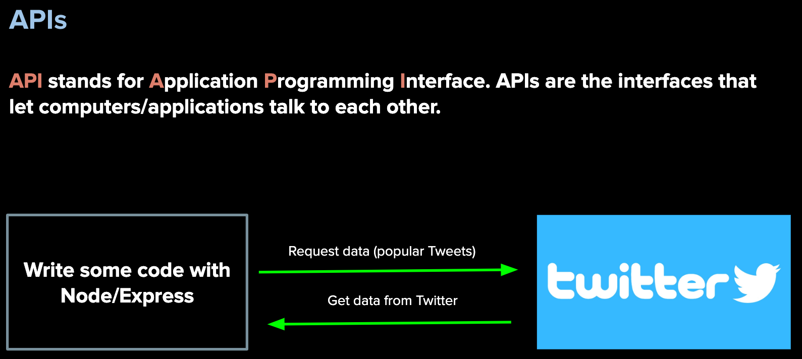
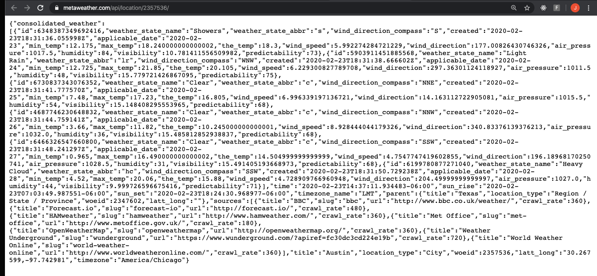
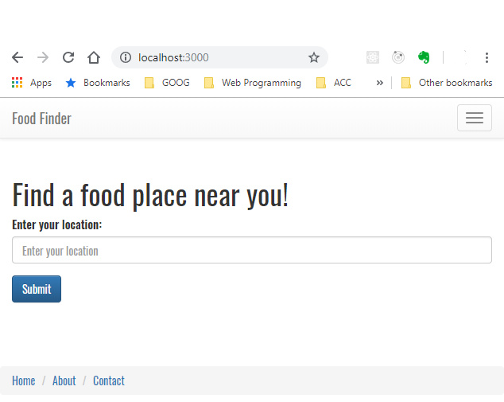
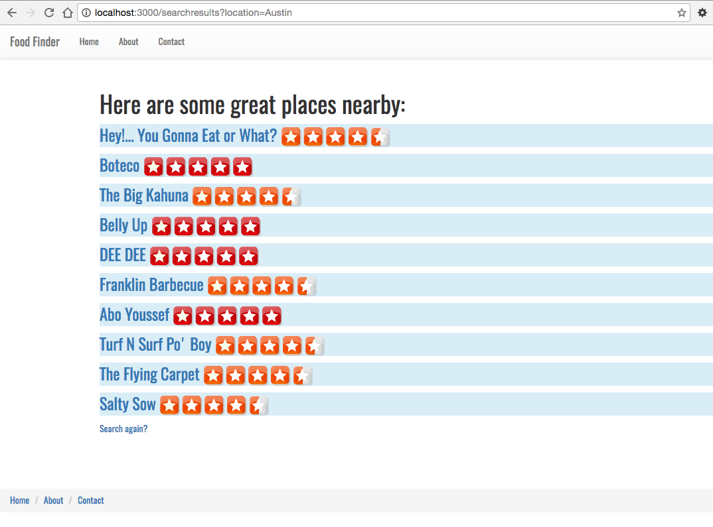
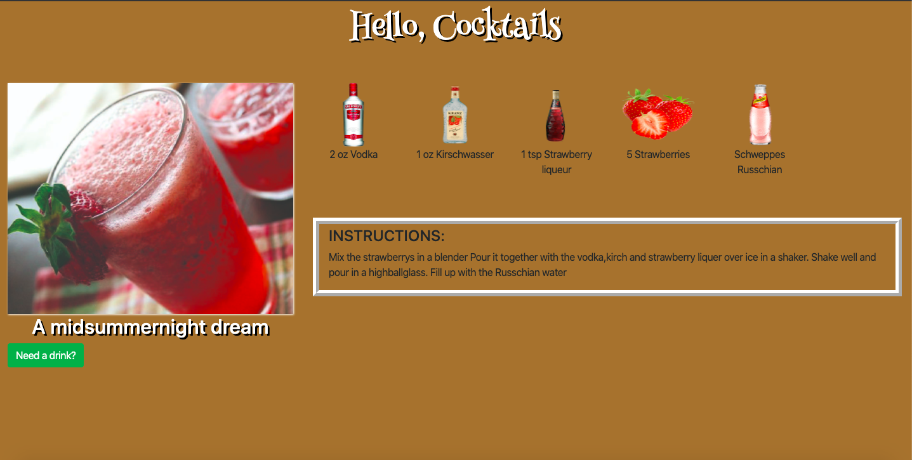
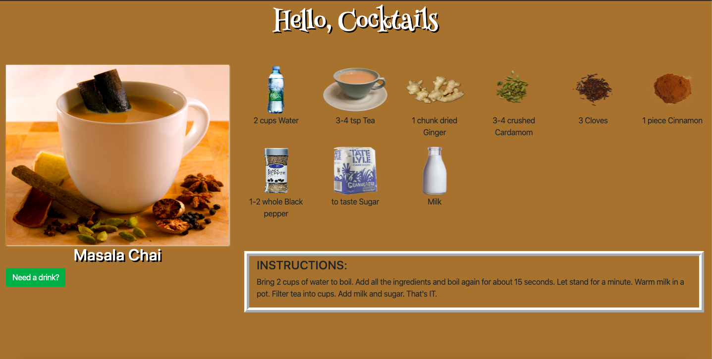
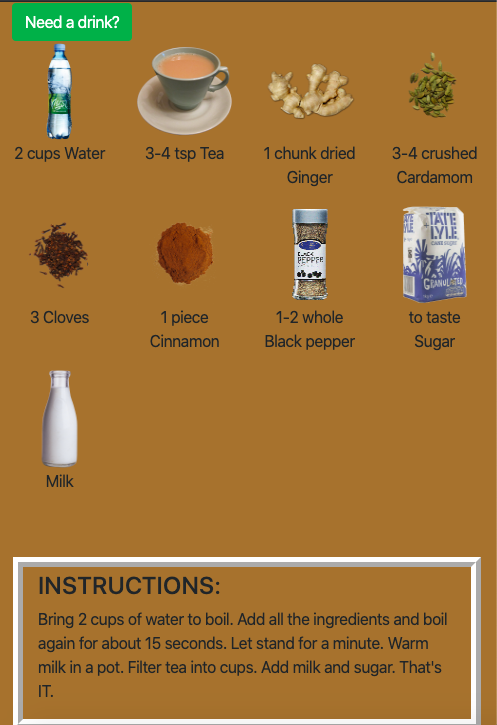

### AUSTIN COMMUNITY COLLEGE
### Web Software Bootcamp

# APIs - Consuming

# Objectives:

1) Introduction/Refresher to APIs
1) Introduction/Refresher to JSON
1) File Structure
1) HTTP requests
    1) Fetch and Promises
    1) Request
    1) Needle
1) Possible In-class Demos
    1) Dog Image App 
    1) Movie App 
    1) Weather App
1) Review of API consumption
1) Labs

# Learning Path

## <a id='_deadlines' href='#deadlines'>1. Deadlines</a>

1. 09/20/2022 - Readings #1, 2, and 3
1. 09/22/2022 - CoderVox 
1. 09/22/2022 - Readings #4
1. 10/05/2022 - ALL API projects should be done
  
## <a id='_readings' href='#readings'>2. Readings</a>

1.  <a id='_subRead1' href='#subRead1' style='color: blue'>Welcome to APIs</a>
1.  <a id='_subRead2' href='#subRead2' style='color: blue'>Consuming an API</a>
1.  <a id='_subRead3' href='#subRead3' style='color: blue'>JSON</a>
1.  <a id='_subRead4' href='#subRead4' style='color: blue'>Request</a>

  

## <a id='_codervox' href='#codervox'>3. CoderVox</a>

## <a id='_projects' href='#projects'>4. Projects</a>

1. <a id='_projects' href='#project1' style='color: blue'>Project #1 - Bitcoin</a>
1. <a id='_projects' href='#project2' style='color: blue'>Project #2 - Movies API</a>
1. <a id='_projects' href='#project3' style='color: blue'>Project #3 - BONUS: Food Finder</a>
1. <a id='_projects' href='#project4' style='color: blue'>Project #4 - BONUS: Cocktails</a>

## <a id='_slides' href='#slides'>5. Slide Decks (if applicable)</a>
 
## <a id='_recommended' href='#recommended'>6. Recommended Resources</a>

1. <a id='_projects' href='#subResource1' style='color: blue'>JSON</a>
1. <a id='_projects' href='#subResource2' style='color: blue'>Fetch Documentation</a>
1. <a id='_projects' href='#subResource3' style='color: blue'>Node-Fetch Documentation</a>
1. <a id='_projects' href='#subResource4' style='color: blue'>Request Documentation</a>
1. <a id='_projects' href='#subResource5' style='color: blue'>Needle Documentation</a>
1. <a id='_projects' href='#subResource6' style='color: blue'>HTTP and Forms</a>
1. <a id='_projects' href='#subResource7' style='color: blue'>File Structures</a>
  

# 
Readings

## 
Welcome to APIs

#### <a id='subRead1' href="#_readings"> (back to top)</a>
 

APIs are an important subject and many companies will ask if you know how to use them, so please pay careful attention to the materials this week. 
You will be using everything that you’ve learned up until this point (HTML, CSS/Bootstrap, JS/Node/Express, EJS, etc.)  
  
With APIs, we can now draw data from external resources, e.g. weather data, restaurant reviews, twitter feeds, youtube videos, github repositories and users, names of your congress persons and senators, currency conversion etc.  

One of the projects will involve you building your own restaurant finding application. When a user enters their city, they would get a list of restaurants near their specified location.

Get ready for the excitement!!!

## 
APIs - an introduction

APIs are a fun topic because it really opens up many possibilities for what you can build. Why? 

You can build applications that use data from other applications. Up until this point, all the data we have seen has been self-generated.
But there are many companies and websites that generously offer their data for us to use as developers

The best way to explain what APIs are, is to take a look at some applications that use them:

[Flickr](https://www.flickr.com/) - get photos from a user(s)

[Reddit](https://www.reddit.com/search/?q=jokes) - get the current jokes

[Facebook](https://www.facebook.com/) - send me the status updates, likes, profile pics, and more

[Twitter](https://twitter.com/) - show me the tweets from a certain celebrity

Take a look here - <b>https://www.programmableweb.com/category/all/apis</b>

And here - <b>https://github.com/public-apis/public-apis</b>

## 
<b>TASK:</b>

Consider the following when looking for APIs:

What kind of documentation is provided? How do you use the API? Are there endpoints? Do you need to pay for it? How many calls can you make?

These are all questions (and more) you should be able to answer when deciding which API will work best for your needs.

Fill out the following form:

## [Form - API Search Practice](https://docs.google.com/forms/d/e/1FAIpQLSepNM5NnWjGI1Xxeaesl6ShiQNQ_Ekp4ClmjJBXvBEF4a7iRg/viewform)

## 
Consuming an API

#### <a id='subRead2' href="#_readings"> (back to top)</a>
 

Now that you have a general idea on what APIs are, can you think of any ideas for websites/applications that you might wish to build?

What are some of your inspirations and aspirations?

How do APIs work? 

## 
Consuming an API

Our first exposure to APIs is generally done through 'consuming' an API. But what does this really mean? 

In short, 'consuming' refers to taking data from a third party and using it for our needs. But this comes with limitations:

  1. You must use endpoints specified in documentation. You cannot randomly assign your own endpoints and expect to get data back.
  2. You are only able to get the data back that the third party will allow. If you think Facebook is going to let you have access to phone numbers and email addresses, you are going to be disappointed.
  3. The third party will also determine the amount of data you get back. Sometimes this will be a limit per day, or even per second.
  4. The third party may also ask you to fill out forms, or join newsletters, or even to pay to use their data.

So when designing an API, you need to ask yourself, what kind of data do you need? How often do you need access to it? What are you going to do with it once you have access to it? Are you using it for personal use or do you plan on monetizing it? 

Obviously, companies like Facebook or Twitter are not going to give you direct access to their databases.

That does not mean they cannot share some of their data with us though. The data they send back looks something like this:

    {
      "coord": {
        "lon": -122.08,
        "lat": 37.39
      },
      "weather": [
        {
          "id": 800,
          "main": "Clear",
          "description": "clear sky",
          "icon": "01d"
        }
      ],
      "base": "stations",
      "main": {
        "temp": 282.55,
        "feels_like": 281.86,
        "temp_min": 280.37,
        "temp_max": 284.26,
        "pressure": 1023,
        "humidity": 100
      }
    }

This is called JSON. But what is it?

## 
JSON

#### <a id='subRead3' href="#_readings"> (back to top)</a>
 

JSON is a data format. Data formats define how data is structured when we get it from an API.
There is another data format called XML which is less commonly used nowadays

JSON stands for <b><u>J</u></b>ava<b><u>S</u></b>cript <b><u>O</u></b>bject <b><u>N</u></b>otation, and it has become popular as it is more understandable and compact than XML, a predecessor.

JSON looks just like a JavaScript object, BUT it is actually a string. 

Notice the double quotes around the keys?

    {
      "firstName": "John",
      "lastName": "Smith",
      "isAlive" : true,
      "age": 25,
      "address" : {
        "streetAddress": "21 2nd Street",
        "city" : "New York",
        "state" : "NY",
        "postalCode" : "10021-3100"
      }
    }

An object does not need quotes around the keys UNLESS the key uses a symbol other than underscore ( _ ) or a decimal, or the key contains a space.

Using quaoted with an object is valid code.

Take a look at the JSON coming from Reddit:
https://www.reddit.com/r/news.json

And the JSON that comes from the MetaWeather API:
https://www.metaweather.com/api/location/2357536/

This probably looks something like what is in your browser:

Looks confusing?  

How can we make it more legible?

## 
JSON View

Install `JSONView` from the Chrome Web Store.  To find it, it is best to Google it.

When installed properly, it will make your JSON more legible. If you refresh your browser and try one of the above JSON links, you should see something like this now:

It may not look like it but it is a STRING!!!!

Not an object.

## 
Request

#### <a id='subRead4' href="#_readings"> (back to top)</a>
 

Now that you have an idea on HOW the data will be sent back, you have to work on building our API. 

There are many ways we can make these HTTP requests. 

We have seen this with `fetch` on the front end and you have seen `needle` in the tutorials for the backend. But there are many other ways: `node-fetch`, `http`, `axios`, `ajax`

We are going to focus on the `request` module -> [request npm](https://www.npmjs.com/package/request).

Request works very similiar to the `needle` module. The main difference is that you must explicitly parse the json with request; with needle, it is done implicitly.

With needle:

    needle.get(endpoint, (err, response) => {
        if (!err && response.statusCode == 200) {
          // json has implicitly been parsed
          res.send(response.body);
        } else {
          res.send("There has been an error!!");
        }
    });

With request:

    request(endpoint, (err, response, body) => {
      if (!err && response.statusCode == 200) {
        // explicitly parse the json
        res.send(JSON.parse(body));
      } else {
        res.send("There has been an error!!");
      }
    }); 

It is vitally important you understand you MUST parse the json with the `JSON.parse()` method.

You may come across documentation stating `request` has been deprecated. All this means is that it is no longer being maintained: no one is fixing issues or making updates for the last two years.

As of this writing, there are almost 17 million weekly  downloads. Pretty good for a deprecated library.

Knowing how to use `request` is still a valuable skill.

# 
Slide Decks

#### <a id='slides' href='#_slides'>(back to top)</a>

No slides at this time

<!-- These slides are for reference only and will not necessarily be used in class:

1. #### [APIs - Introduction - Weather App](https://docs.google.com/presentation/d/1yMYeVqPawPb50p9BveL7jPfkCFXaqZ6w8SP2NzliKnk/edit?usp=sharing)
1. #### [Consuming APIs - Dog Image and Bitcoin](https://docs.google.com/presentation/d/1TpqNwlLVTzcGCJ-63aMKO0ZmmZDK8VJRZgoWHWb3d_4/edit?usp=sharing)
1. #### [Consuming APIs - Pt2 - Fetch API](https://docs.google.com/presentation/d/1wn8oLdS3l-IPUXBgZrV3DLjQD9RlS5Q8bL8Pi4yKyks/edit?usp=sharing)  -->

# 
CoderVox

#### <a id='codervox' href='#_codervox'>(back to top)</a>

## Tutorial
<h2 style='color: red'>TIME REQUIRED - 2 hours</h3>

Please go through the following CoderVox videos before proceeding.

Please note, the tutorial uses a module called <u>Needle</u> - this is very similar to the <u>Request</u> module we will use in class.

See below under Recommended Resources for documentation, if you need.

### [CoderVox - JavaScript](https://codervox.com/p/the-online-web-developers-bootcamp/?product_id=2625725&coupon_code=READYTOLEARNONLINE)

Section 23 - only

# 
Projects

## 
Project #1 - Bitcoin

#### <a id='project1' href="#_projects"> (back to top)</a>
 

## Bitcoin Price Checker App

In this project, you are going to build an app that retrieves the current price of Bitcoin and displays it in the browser, when the user clicks a button.

In order to complete this exercise, you will require the following API documentation:

https://old.coindesk.com/coindesk-api

Check it out and get familiar with how to use it. This will be done with a server and EJS. You may use `node-fetch`, `request`, or `needle`.

Your finished app page, should look something like this

<strong>Hints:</strong>

These might help you build the above app:

1. Use `index.ejs`,  `header.ejs` and `footer.ejs`

1. Make sure to include `Powered by CoinDesk` per CoinDesk documentation

1. HTML Forms: learn how to use a form and a input of type submit.

1. How exactly does the GET method work?

1. What is the difference between `req.params` and `req.query`?  What would you use in this app?

1. HTML entities

1. Research the differences between `<% %>` , `<%= %>` , `<%- %>`

1. You may need and use [number methods](https://www.w3schools.com/js/js_number_methods.asp)

## 
Project #2 - Movie API

#### <a id='project2' href="#_projects"> (back to top)</a>
 

## Movies Playing Now

This project is designed to test your knowledge of the front end as well as the back end. You will be building an application that allows users to find current movies playing in the theaters. Use EJS.

The home page should look somthing like this: 

Go to pixabay.com and search for an appropriate image and use `h1` tags for the text on main page.

When they click on the button, they are taken to a page that looks like this (note that the movies listed may be different from you have): 

When the user clicks on the button on the home page, they are taken to another page which lists four things: the movie title, overview, rating, and poster image.

You will be using the The Movie Database API. Its documentation can be found here: [API Docs](https://developers.themoviedb.org/3). 

Please note that a user key is required to read the data. It is free to sign up. Read the instructions on how to use the API. 

### NOTE: You <b><u>WILL</u></b> be using this API multiple times throughout the rest of the Bootcamp so please sign up for the API key.

Remember, you want to list the movies `now playing` in theaters.

Make sure you check out TMDb documentation on how to grab `images` and their paths.

Install `nodemon` as a dev dependency. Even if you installed globally, please install as a dev dependency. If you do not, you may run into issues.

Lastly, add the following to your package.json:

    "nodemonConfig": {
      "delay": "2500",
      "env": {
        "NODE_ENV": "development",
        "PORT": "3001"
      }
    }

This tells `nodemon` to wait 2.5 seconds before restarting when a change is made.

Also, it sets the environment as development and the port to 3001.

You will know that you have done this correctly, because when you start your server, it should automatically be listening on port 3001. 

Start your server with `nodemon` 
If you have not done so, you may need to check out docs here: npmjs.com/package/nodemon

How do you display in your browser?

## 
Project #3 - BONUS: Food Finder

#### <a id='project3' href="#_projects"> (back to top)</a>
 

## Yelp Food Finder

1. We will be using the public API from Yelp. In order to use it, you’ll need to create an account on Yelp. From the developers page, you’ll need to retrieve your client ID, and API key: https://www.yelp.com/developers/v3/manage_app

1. You will also be using the Yelp nodejs module. This module will make it easier for us to make requests. https://www.npmjs.com/package/yelp-fusion

1. You will also need EJS and Express.

1. You should also look at the Yelp documentation, especially on the search parameters when making requests: https://www.yelp.com/developers/documentation/v3/get_started

1. Create two main pages: 
  - home.ejs page, and 
  - searchresults.ejs page.

1. The home.ejs page has a form that allows a user to enter a city. When they hit the submit button, it should take them to the searchresults.ejs page where the list of restaurants is displayed.

1. The searchresults.ejs page should display up to 10 search results. They should be linked to their respective Yelp page, and an image of their rating should be next to each link.

1. Use bootstrap for styling.

1. Use partials to hold your boilerplate header and footer HTML code.

1. This project will exercise your ability to drill down on an object. If you need help, ask!!

Screenshots of the project:

## 
Project #4 - BONUS: Cocktails

#### <a id='project4' href="#_projects"> (back to top)</a>
 

Your goal is to build a site that allows the user to click a button and a random drink is displayed in the browser similar to that below:

Click the button and you get a new drink:

and when you are on a small screen, everything will stack on top of each other:

 

1. Use the following for documentation: https://www.thecocktaildb.com/api.php

1. Use&nbsp;` Henny Penny` &nbsp;from Google Fonts in an `<h1>` tag for the `"Hello, Cocktails"`

1. Use &nbsp;`Bootstrap` for responsiveness

1. Use the following drink object for initial screen data (if you need):

        const initDrink = {
          strInstructions: `Mix lemonade and water according to instructions on back of can. If the instructions say 
          to add 4 1/3 cans of water do so. Mix into pitcher. Add 1 1/2 cup of Vodka (Absolut). 
          Mix well. Pour into glass of crushed ice. Excellent!`,
          strDrink: 'Shark Attack',
          strDrinkThumb: `https://www.thecocktaildb.com/images/media/drink/uv96zr1504793256.jpg`,
          strIngredient1: 'Vodka',
          strIngredient2: 'Vodka',
          strIngredient3: 'Vodka',
          strIngredient4: 'Vodka',
          strMeasure1: '1st can',
          strMeasure2: '2nd can',
          strMeasure3: '3rd can',
          strMeasure4: '4th can',
          imageSrc: "https://www.thecocktaildb.com/images/ingredients/gin-Small.png"
    }

# 
Recommended Resources :

## 
JSON

#### <a id='subResource1' href="#_recommended"> (back to top)</a>
 

Please go through the following tutorials on [W3Schools](https://www.w3schools.com/js/js_json_intro.asp) to get a better idea of what JSON is and how it works. Spend as much time as you need to feel comfortable:

1. JSON Intro
2. JSON Syntax
3. JSON vs XML
4. JSON Data Types
5. JSON Parse
6. JSON Stringify
7. JSON Objects
8. JSON Arrays

## 
Fetch Documentation

#### <a id='subResource2' href="#_recommended"> (back to top)</a>
 

Please check out [MDN](https://developer.mozilla.org/en-US/docs/Web/API/Fetch_API/Using_Fetch) Web docs for more details on Fetch

## 
Node-Fetch Documentation

#### <a id='subResource3' href="#_recommended"> (back to top)</a>
 

Please check out [NPM Node-Fetch module](https://www.npmjs.com/package/node-fetch) web docs for more details on Node-Fetch

## 
Request Documentation

#### <a  id='subResource4' href="#_recommended"> (back to top)</a>
 

Please check out [NPM Request module](https://www.npmjs.com/package/request) web docs for more details on Request

## 
Needle Documentation

#### <a id='subResource5' href="#_recommended"> (back to top)</a>
 

Please check out [NPM Needle module](https://www.npmjs.com/package/needle) web docs for more details on Needle

## 
HTTP and Forms

#### <a id='subResource6' href="#_recommended"> (back to top)</a>
 

### ***TIME required - 30 minutes***

Please read to learn more about how forms, HTTP requests, and fetch all work together.

[Eloquent JavaScript - Chapter 18 - HTTP and Forms](https://eloquentjavascript.net/18_http.html#p_s1KEZa2j+E)

## 
File Structure

#### <a id='subResource7' href="#_recommended"> (back to top)</a>
 

FILE STRUCTURES (order may vary):

	Basic Backend (server):
		PARENT FOLDER
              app.js
              package.json
              package-lock.json
              node-modules (folder)

	Basic Backend (server and EJS):
		PARENT FOLDER
              app.js
              package.json
              package-lock.json
              node-modules (folder)
              views (folder)
                  home.ejs
                  partials (folder)
                      header.ejs
                      navbar.ejs
                      footer.ejs

	Basic Backend (server, EJS, and CSS):
		PARENT FOLDER
              app.js
              public (folder)
                  style.css
              package.json
              package-lock.json
              node-modules (folder)
              views (folder)
                  home.ejs
                  partials (folder)
                      header.ejs
                      navbar.ejs
                      footer.ejs
                      whatever.ejs

